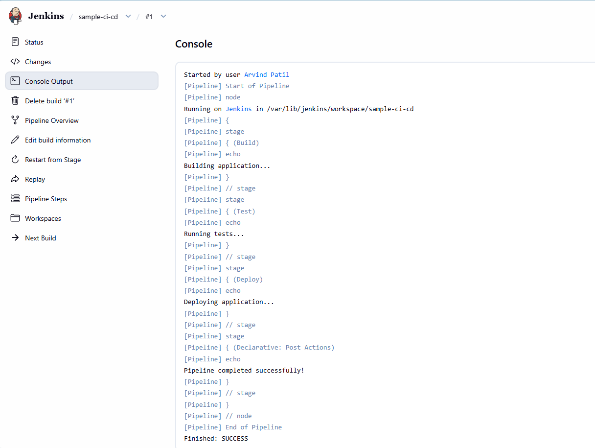
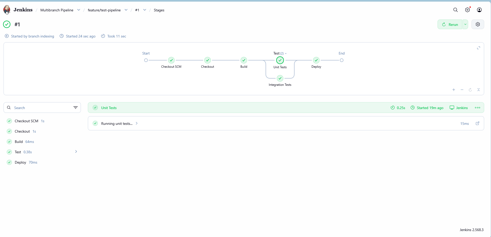

# Week 6: Jenkins CI/CD — Basics and Advanced Real-World Challenge

## Overview

This document contains my complete implementation and learning notes for the Week 6 Jenkins CI/CD challenge.

The environment used for this challenge:

* **OS:** Windows 11
* **Linux Environment:** WSL2
* **Linux Distribution:** Ubuntu
* **CI/CD Tool:** Jenkins
* **Java:** OpenJDK 21
* **Containerization:** Docker
* **Source Control:** Git / GitHub
* **Security Scanning:** Trivy
* **Pipeline:** Jenkins Declarative Pipeline

---

# Environment Setup

## 1. Start WSL

Open Windows PowerShell and run:

```powershell
wsl
```

Verify the Linux distribution:

```bash
lsb_release -a
```

---

## 2. Update Ubuntu

```bash
sudo apt update
sudo apt upgrade -y
```

---

## 3. Install Java

Jenkins requires Java.

```bash
sudo apt install fontconfig openjdk-21-jre -y
```

Verify Java:

```bash
java -version
```

Expected output:

```text
openjdk version "21..."
```

---

## 4. Add Jenkins Repository

Download the Jenkins repository key:

```bash
sudo wget -O /etc/apt/keyrings/jenkins-keyring.asc \
https://pkg.jenkins.io/debian-stable/jenkins.io-2026.key
```

Add the Jenkins repository:

```bash
echo "deb [signed-by=/etc/apt/keyrings/jenkins-keyring.asc] \
https://pkg.jenkins.io/debian-stable binary/" | \
sudo tee /etc/apt/sources.list.d/jenkins.list > /dev/null
```

Update package information:

```bash
sudo apt update
```

---

## 5. Install Jenkins

```bash
sudo apt install jenkins -y
```

Verify:

```bash
jenkins --version
```

---

## 6. Start Jenkins

```bash
sudo systemctl start jenkins
```

Check Jenkins status:

```bash
sudo systemctl status jenkins
```

Expected status:

```text
Active: active (running)
```

---

## 7. Get Initial Jenkins Password

```bash
sudo cat /var/lib/jenkins/secrets/initialAdminPassword
```

Copy the generated password.

---

## 8. Open Jenkins

Open the Windows browser:

```text
http://localhost:8080
```

Complete the initial Jenkins setup:

1. Enter Initial Admin Password.
2. Select **Install suggested plugins**.
3. Create the first admin user.
4. Complete Jenkins setup.
5. Open Jenkins Dashboard.

---

# TASK 1: Create a Jenkins Pipeline Job for CI/CD

## Objective

Create an end-to-end CI/CD pipeline with the following stages:

```text
Build → Test → Deploy
```

---

## Step 1: Create Pipeline Job

Open Jenkins Dashboard.

Go to:

```text
New Item
```

Enter:

```text
sample-ci-cd
```

Select:

```text
Pipeline
```

Click:

```text
OK
```

---

## Step 2: Configure Pipeline

Go to:

```text
Pipeline
```

Select:

```text
Definition: Pipeline script
```

---

## Step 3: Jenkinsfile

Use the following Declarative Pipeline:

```groovy
pipeline {
    agent any

    stages {

        stage('Build') {
            steps {
                echo 'Building application...'
            }
        }

        stage('Test') {
            steps {
                echo 'Running tests...'
            }
        }

        stage('Deploy') {
            steps {
                echo 'Deploying application...'
            }
        }
    }

    post {
        success {
            echo 'Pipeline completed successfully!'
        }

        failure {
            echo 'Pipeline failed!'
        }
    }
}
```

---

## Step 4: Save and Run

Click:

```text
Save
```

Then:

```text
Build Now
```

Open:

```text
Build #1
→ Console Output
```

Expected output:

```text
Building application...
Running tests...
Deploying application...
Pipeline completed successfully!
Finished: SUCCESS
```

---

## Verification

The pipeline successfully executed all three stages:

```text
Build
  ↓
Test
  ↓
Deploy
```

---

## Observation

Breaking a CI/CD pipeline into separate stages makes the pipeline easier to understand, troubleshoot and maintain.

Each stage has a specific responsibility.

---

## Screenshot

Add the Jenkins pipeline screenshot here:




---

## Interview Questions

### Q1. How do Declarative Pipelines streamline CI/CD?

Declarative Pipelines provide a structured and readable syntax for defining CI/CD workflows. Stages, agents, parameters and post-build actions can be clearly defined.

### Q2. What are the benefits of separate stages?

Separate stages make the pipeline easier to:

* Understand
* Debug
* Monitor
* Maintain
* Modify

---

# TASK 2: Build a Multi-Branch Pipeline

## Objective

Create a Multibranch Pipeline for a microservices-style application.

The pipeline should discover different Git branches and execute the Jenkinsfile available in those branches.

---

## Step 1: Create GitHub Repository

Create a GitHub repository:

```text
jenkins-multibranch-demo
```

Clone it:

```bash
git clone https://github.com/YOUR_USERNAME/jenkins-multibranch-demo.git
```

Enter the repository:

```bash
cd jenkins-multibranch-demo
```

---

## Step 2: Create Jenkinsfile

Create:

```bash
nano Jenkinsfile
```

Add:

```groovy
pipeline {
    agent any

    stages {

        stage('Checkout') {
            steps {
                checkout scm
            }
        }

        stage('Build') {
            steps {
                echo 'Building application...'
            }
        }

        stage('Test') {
            parallel {

                stage('Unit Tests') {
                    steps {
                        echo 'Running unit tests...'
                    }
                }

                stage('Integration Tests') {
                    steps {
                        echo 'Running integration tests...'
                    }
                }
            }
        }

        stage('Deploy') {
            steps {
                echo 'Deploying application...'
            }
        }
    }
}
```

---

## Step 3: Push Jenkinsfile

```bash
git add Jenkinsfile
git commit -m "Add multibranch Jenkins pipeline"
git push origin main
```

---

## Step 4: Create Feature Branch

```bash
git checkout -b feature/test-pipeline
```

Make a change:

```bash
echo "# Multibranch Pipeline Demo" >> README.md
```

Commit:

```bash
git add .
git commit -m "Test feature branch"
```

Push:

```bash
git push origin feature/test-pipeline
```

---

## Step 5: Create Multibranch Pipeline in Jenkins

Jenkins Dashboard:

```text
New Item
→ Multibranch Pipeline
→ OK
```

Configure:

```text
Branch Sources
→ Git
```

Repository URL:

```text
https://github.com/YOUR_USERNAME/jenkins-multibranch-demo.git
```

Save the configuration.

Then select:

```text
Scan Multibranch Pipeline Now
```

Jenkins should discover:

```text
main
feature/test-pipeline
```

---

## Verification

The Multibranch Pipeline successfully detected branches containing the Jenkinsfile.

---

## Observation

Multibranch Pipelines are useful when different branches require independent CI execution.

They are especially useful for development workflows where feature branches need to be automatically built and tested.

---

## Screenshot

```text

```

---

## Interview Questions

### Q1. How does a Multibranch Pipeline improve CI?

It automatically discovers branches and executes the Jenkinsfile associated with each branch.

### Q2. What challenges can occur when merging feature branches?

Common challenges include:

* Merge conflicts
* Failed tests
* Different dependency versions
* Configuration differences
* Pipeline failures

---

# TASK 3: Configure and Scale Jenkins Agents / Nodes

## Objective

Configure Jenkins agents to distribute build workloads.

---

## Step 1: Open Node Configuration

Go to:

```text
Manage Jenkins
→ Nodes
```

Select:

```text
New Node
```

Create:

```text
linux-agent
```

Select:

```text
Permanent Agent
```

---

## Step 2: Configure Agent

Remote root directory:

```text
/home/jenkins-agent
```

Label:

```text
linux
```

Save the configuration.

---

## Step 3: Use Agent Label

Example Jenkinsfile:

```groovy
pipeline {
    agent none

    stages {

        stage('Linux Build') {
            agent {
                label 'linux'
            }

            steps {
                sh 'uname -a'
                sh 'whoami'
                sh 'pwd'
            }
        }
    }
}
```

---

## Step 4: Run Pipeline

Run the pipeline and verify that the job executes on the Linux-labelled agent.

---

## Verification

The agent is identified by the label:

```text
linux
```

The pipeline uses:

```groovy
agent {
    label 'linux'
}
```

---

## Observation

Distributed Jenkins agents allow workloads to be distributed across different machines or environments.

This can improve:

* Build scalability
* Resource utilization
* Parallel execution
* Platform-specific builds

---

## Screenshot

```text

```

---

## Interview Questions

### Q1. Benefits of distributed Jenkins agents?

They distribute workloads and prevent all builds from depending on a single execution environment.

### Q2. How do you assign jobs to the correct agent?

Use Jenkins labels:

```groovy
agent {
    label 'linux'
}
```

---

# TASK 4: Implement RBAC in Jenkins

## Objective

Configure role-based access for different teams.

Roles:

```text
Admin
Developer
Tester
```

---

## Step 1: Install Role Strategy Plugin

Go to:

```text
Manage Jenkins
→ Plugins
→ Available Plugins
```

Search:

```text
Role-based Authorization Strategy
```

Install the plugin.

---

## Step 2: Enable Role-Based Authorization

Go to:

```text
Manage Jenkins
→ Security
```

Under Authorization select:

```text
Role-Based Strategy
```

Save.

---

## Step 3: Create Roles

Go to:

```text
Manage Jenkins
→ Manage and Assign Roles
→ Manage Roles
```

Create:

```text
admin
developer
tester
```

---

## Admin Permissions

Administrator can have:

```text
Overall/Administer
```

---

## Developer Permissions

Example permissions:

```text
Overall/Read
Job/Read
Job/Build
Job/Workspace
```

---

## Tester Permissions

Example:

```text
Overall/Read
Job/Read
Job/Build
```

---

## Step 4: Create Test Users

Go to:

```text
Manage Jenkins
→ Users
→ Create User
```

Create:

```text
developer1
tester1
```

Assign the appropriate roles.

---

## Step 5: Verify

Login with the test accounts and verify that each user receives only the permissions assigned to the corresponding role.

---

## Observation

RBAC helps implement the principle of least privilege.

Different teams can receive only the permissions required for their responsibilities.

---

## Security Risk Example

If every Jenkins user has administrator permissions, a user could potentially modify pipelines, credentials or Jenkins configuration beyond their job responsibilities.

RBAC reduces this type of unnecessary access.

---

## Screenshot

```text

```

---

## Interview Questions

### Q1. Why is RBAC important?

RBAC controls who can perform specific actions in Jenkins.

### Q2. What can happen with weak access control?

Users may receive unnecessary privileges and could accidentally or intentionally modify CI/CD infrastructure.

---

# TASK 5: Jenkins Shared Library

## Objective

Create reusable Jenkins pipeline functions to reduce duplicate code.

---

## Step 1: Create GitHub Repository

Create:

```text
jenkins-shared-library
```

Clone:

```bash
git clone https://github.com/YOUR_USERNAME/jenkins-shared-library.git
cd jenkins-shared-library
```

---

## Step 2: Create Library Directory

```bash
mkdir vars
```

Create:

```bash
nano vars/sayHello.groovy
```

Add:

```groovy
def call(String name) {
    echo "Hello ${name}!"
}
```

---

## Step 3: Commit and Push

```bash
git add .
git commit -m "Add Jenkins shared library"
git push origin main
```

---

## Step 4: Configure Global Shared Library

Jenkins:

```text
Manage Jenkins
→ System
→ Global Trusted Pipeline Libraries
```

Add:

```text
Name:
my-shared-library
```

Default version:

```text
main
```

Configure the Git repository:

```text
https://github.com/YOUR_USERNAME/jenkins-shared-library.git
```

Save.

---

## Step 5: Use Shared Library

Jenkinsfile:

```groovy
@Library('my-shared-library') _

pipeline {
    agent any

    stages {

        stage('Shared Library Test') {
            steps {
                sayHello('Arvind')
            }
        }
    }
}
```

---

## Expected Output

```text
Hello Arvind!
```

---

## Observation

Shared Libraries allow teams to create reusable pipeline functions.

Benefits:

* Code reuse
* Consistency
* Easier maintenance
* Less duplicated Jenkinsfile code
* Centralized pipeline logic

---

## Screenshot

```text

```

---

## Interview Questions

### Q1. What is a Jenkins Shared Library?

A Jenkins Shared Library is a centralized repository containing reusable pipeline code.

### Q2. What can be placed in a Shared Library?

Examples include:

* Deployment functions
* Testing functions
* Notifications
* Security checks
* Common pipeline stages

---

# TASK 6: Integrate Trivy Vulnerability Scanning

## Objective

Scan Docker images for known vulnerabilities as part of CI/CD.

---

## Step 1: Install Docker

```bash
sudo apt update
sudo apt install docker.io -y
```

Start Docker:

```bash
sudo service docker start
```

Verify:

```bash
docker --version
```

```bash
docker ps
```

---

## Step 2: Install Trivy

Install Trivy using the appropriate official package/repository method for the Ubuntu environment.

Verify:

```bash
trivy --version
```

---

## Step 3: Build Docker Image

Example:

```bash
docker build -t yourusername/sample-app:v1.0 .
```

Verify:

```bash
docker images
```

---

## Step 4: Scan Image

```bash
trivy image yourusername/sample-app:v1.0
```

For HIGH and CRITICAL vulnerabilities:

```bash
trivy image \
--severity HIGH,CRITICAL \
yourusername/sample-app:v1.0
```

---

## Step 5: Add Trivy to Jenkins Pipeline

```groovy
pipeline {
    agent any

    environment {
        IMAGE_NAME = 'yourusername/sample-app:v1.0'
    }

    stages {

        stage('Build') {
            steps {
                sh 'docker build -t $IMAGE_NAME .'
            }
        }

        stage('Vulnerability Scan') {
            steps {
                sh '''
                    trivy image \
                    --severity HIGH,CRITICAL \
                    --exit-code 1 \
                    $IMAGE_NAME
                '''
            }
        }

        stage('Deploy') {
            steps {
                echo 'Deploying application...'
            }
        }
    }
}
```

---

## Verification

The pipeline now contains:

```text
Build
 ↓
Vulnerability Scan
 ↓
Deploy
```

The scan can prevent the pipeline from continuing when the configured vulnerability criteria cause Trivy to return a failure code.

---

## Observation

Security scanning should be integrated into CI/CD so vulnerabilities can be identified before an image is deployed.

---

## Screenshot

```text

```

---

## Interview Questions

### Q1. Why integrate vulnerability scanning into CI/CD?

It helps identify security vulnerabilities early in the software delivery process.

### Q2. How does Trivy help?

Trivy scans container images and reports known vulnerabilities with severity information.

---

# TASK 7: Dynamic Pipeline Parameterization

## Objective

Make the Jenkins pipeline configurable at runtime.

Parameters:

```text
TARGET_ENV
APP_VERSION
```

---

## Jenkinsfile

```groovy
pipeline {
    agent any

    parameters {

        choice(
            name: 'TARGET_ENV',
            choices: ['dev', 'staging', 'production'],
            description: 'Deployment target environment'
        )

        string(
            name: 'APP_VERSION',
            defaultValue: '1.0.0',
            description: 'Application version'
        )
    }

    stages {

        stage('Build') {
            steps {
                echo "Building version ${params.APP_VERSION}"
            }
        }

        stage('Test') {
            steps {
                echo "Testing version ${params.APP_VERSION}"
            }
        }

        stage('Deploy') {
            steps {
                echo "Deploying ${params.APP_VERSION} to ${params.TARGET_ENV}"
            }
        }
    }
}
```

---

## Step 2: Run with Parameters

Select:

```text
Build with Parameters
```

Example:

```text
TARGET_ENV = staging
APP_VERSION = 1.2.0
```

Expected output:

```text
Building version 1.2.0
Testing version 1.2.0
Deploying 1.2.0 to staging
```

---

## Observation

Pipeline parameters make CI/CD workflows more flexible because the same pipeline can be executed with different runtime values.

---

## Screenshot

```text

```

---

## Interview Questions

### Q1. How does parameterization improve CI/CD?

It allows one pipeline to handle multiple environments, versions and deployment configurations.

### Q2. Give an example.

The same pipeline can deploy:

```text
version 1.0.0 → dev
version 1.1.0 → staging
version 1.2.0 → production
```

with appropriate runtime controls.

---

# TASK 8: Email Notifications

## Objective

Configure Jenkins to send notifications for build events.

---

## Step 1: Install Email Extension Plugin

Go to:

```text
Manage Jenkins
→ Plugins
→ Available Plugins
```

Search:

```text
Email Extension Plugin
```

Install it.

---

## Step 2: Configure SMTP

Go to:

```text
Manage Jenkins
→ System
```

Find:

```text
Extended E-mail Notification
```

Configure:

* SMTP server
* SMTP port
* Authentication
* Credentials
* Sender email

For Gmail, use an appropriate **App Password** rather than exposing the normal account password.

---

## Step 3: Jenkinsfile Notification

```groovy
pipeline {
    agent any

    stages {

        stage('Build') {
            steps {
                echo 'Building application...'
            }
        }

        stage('Test') {
            steps {
                echo 'Testing application...'
            }
        }
    }

    post {

        success {
            emailext(
                subject: "SUCCESS: ${env.JOB_NAME} #${env.BUILD_NUMBER}",
                body: "Build completed successfully. URL: ${env.BUILD_URL}",
                to: "your-email@example.com"
            )
        }

        failure {
            emailext(
                subject: "FAILED: ${env.JOB_NAME} #${env.BUILD_NUMBER}",
                body: "Build failed. URL: ${env.BUILD_URL}",
                to: "your-email@example.com"
            )
        }
    }
}
```

---

## Step 4: Test

Run:

```text
Build Now
```

Verify the configured mailbox.

---

## Observation

Automated notifications help development and operations teams know when builds succeed or fail without manually checking Jenkins.

---

## Screenshot

```text

```

---

## Interview Questions

### Q1. Why use automated notifications?

They provide quick visibility into CI/CD pipeline results.

### Q2. How would you troubleshoot email failures?

Check:

1. SMTP server
2. SMTP port
3. Credentials
4. Jenkins logs
5. Email Extension configuration
6. Recipient address
7. SMTP authentication requirements

---

# TASK 9: Troubleshooting, Monitoring and Advanced Debugging

## Objective

Simulate Jenkins failures and practice troubleshooting.

---

# Step 1: Simulate Pipeline Failure

Add:

```groovy
stage('Failure Test') {
    steps {
        sh 'exit 1'
    }
}
```

Run the pipeline.

Expected:

```text
Finished: FAILURE
```

---

# Step 2: Check Console Output

Go to:

```text
Build #X
→ Console Output
```

Look for:

```text
ERROR
FAILURE
exit code
```

Identify the stage where the failure occurred.

---

# Step 3: Add Debug Statements

Use:

```groovy
echo "Job Name: ${env.JOB_NAME}"
echo "Build Number: ${env.BUILD_NUMBER}"
echo "Workspace: ${env.WORKSPACE}"
```

For Linux commands:

```groovy
sh 'pwd'
sh 'ls -la'
```

---

# Step 4: Docker Troubleshooting

Check running containers:

```bash
docker ps
```

Check all containers:

```bash
docker ps -a
```

Check container logs:

```bash
docker logs <container_id>
```

Check Docker information:

```bash
docker info
```

---

# Step 5: Jenkins Logs

Check Jenkins service logs:

```bash
sudo journalctl -u jenkins
```

Follow Jenkins logs:

```bash
sudo journalctl -u jenkins -f
```

---

# Step 6: Jenkins Replay

Open a completed Pipeline build:

```text
Build
→ Replay
```

Replay can be used to test pipeline modifications while troubleshooting.

---

# Step 7: Troubleshooting Method

My troubleshooting process:

```text
Pipeline Failure
      ↓
Check Stage
      ↓
Check Console Output
      ↓
Identify Error
      ↓
Check Environment
      ↓
Check Dependencies
      ↓
Check Docker/Jenkins Logs
      ↓
Fix Problem
      ↓
Run Pipeline Again
      ↓
Verify SUCCESS
```

---

## Observation

Effective troubleshooting requires checking logs, identifying the exact failing stage, reproducing the issue and validating the fix.

---

## Screenshot

```text

```

---

# Final Jenkins CI/CD Pipeline

The concepts covered in this challenge can be combined into a real-world pipeline:

```text
Developer
    |
    v
GitHub
    |
    v
Jenkins
    |
    +---- Checkout
    |
    +---- Build
    |
    +---- Test
    |
    +---- Trivy Security Scan
    |
    +---- Docker Build
    |
    +---- Deploy
    |
    +---- Email Notification
    |
    v
Application
```

---

# Key Jenkins Concepts Learned

## 1. Jenkins Pipeline

Automates software delivery using defined stages.

## 2. Multibranch Pipeline

Automatically handles multiple Git branches.

## 3. Jenkins Agents

Allows workloads to execute on different nodes.

## 4. RBAC

Controls access based on user roles.

## 5. Shared Libraries

Provides reusable pipeline code.

## 6. Trivy

Scans container images for vulnerabilities.

## 7. Parameters

Allows runtime configuration of pipelines.

## 8. Email Notifications

Notifies teams about build results.

## 9. Troubleshooting

Uses console output, system logs, Docker logs and Replay for debugging.

---

# Important Commands

## Jenkins

```bash
jenkins --version
```

```bash
sudo systemctl start jenkins
```

```bash
sudo systemctl stop jenkins
```

```bash
sudo systemctl restart jenkins
```

```bash
sudo systemctl status jenkins
```

```bash
sudo journalctl -u jenkins
```

---

## Java

```bash
java -version
```

---

## Docker

```bash
docker --version
```

```bash
docker ps
```

```bash
docker ps -a
```

```bash
docker images
```

```bash
docker build -t sample-app:v1.0 .
```

```bash
docker logs <container_id>
```

---

## Git

```bash
git status
```

```bash
git add .
```

```bash
git commit -m "Add Jenkins CI/CD challenge"
```

```bash
git push origin main
```

---

## Trivy

```bash
trivy --version
```

```bash
trivy image sample-app:v1.0
```

```bash
trivy image --severity HIGH,CRITICAL sample-app:v1.0
```

---

# Evidence / Screenshots

Add screenshots for the following:

```text
1. Jenkins Dashboard
2. Jenkins Installation
3. Task 1 Pipeline
4. Task 1 Console Output
5. Task 2 Multibranch Pipeline
6. Task 2 Branch Discovery
7. Task 3 Jenkins Agent
8. Task 4 RBAC Roles
9. Task 4 Test User
10. Task 5 Shared Library
11. Task 6 Trivy Scan
12. Task 7 Build with Parameters
13. Task 8 Email Notification
14. Task 9 Failed Pipeline
15. Task 9 Troubleshooting Logs
16. Final Successful Pipeline
```

Example:

```markdown

```

---

# Final Result

The Week 6 Jenkins CI/CD challenge was completed using Jenkins running in WSL2.

The implementation covered:

* Jenkins installation
* CI/CD Pipeline
* Multibranch Pipeline
* Jenkins Agents
* RBAC
* Shared Libraries
* Trivy Vulnerability Scanning
* Dynamic Pipeline Parameters
* Email Notifications
* Troubleshooting and Debugging

These concepts provide practical experience with Jenkins CI/CD workflows and common DevOps automation scenarios.

---

# Conclusion

This challenge helped me understand how Jenkins can be used to automate the software delivery lifecycle.

I practiced creating pipelines, managing branches, distributing workloads using agents, controlling access with RBAC, reusing pipeline code through Shared Libraries, integrating security scanning with Trivy, using runtime parameters, configuring notifications and troubleshooting failed builds.

The next step is to combine these concepts into a production-style Jenkins CI/CD pipeline with GitHub, Docker, security scanning and automated deployment.

---

# Submission Checklist

Before submitting the challenge, verify:

* [ ] Jenkins installed successfully
* [ ] Jenkins accessible at `http://localhost:8080`
* [ ] Task 1 pipeline completed
* [ ] Task 2 Multibranch Pipeline configured
* [ ] Task 3 Jenkins agent configured
* [ ] Task 4 RBAC configured
* [ ] Task 5 Shared Library configured
* [ ] Task 6 Trivy integrated
* [ ] Task 7 Pipeline parameters tested
* [ ] Task 8 Email notification tested
* [ ] Task 9 Troubleshooting completed
* [ ] Screenshots added
* [ ] Jenkinsfiles committed
* [ ] `solution.md` completed
* [ ] Changes pushed to GitHub
* [ ] Pull Request created

---

# Interview Preparation

## Jenkins

**What is Jenkins?**

Jenkins is an automation server commonly used to implement CI/CD pipelines.

**What is a Jenkins Pipeline?**

A Jenkins Pipeline defines automated stages for building, testing and delivering software.

**What is a Jenkinsfile?**

A Jenkinsfile is a file containing the pipeline definition as code.

**What is a Jenkins Agent?**

A Jenkins Agent is an execution environment where Jenkins can run pipeline tasks.

**What is a Multibranch Pipeline?**

A Multibranch Pipeline automatically discovers branches in a source-control repository and executes the Jenkinsfile associated with each branch.

**What is RBAC?**

RBAC means Role-Based Access Control. It assigns permissions according to user roles.

**What is a Shared Library?**

A Shared Library is reusable Jenkins pipeline code stored separately and loaded into pipelines.

**Why use Trivy?**

Trivy can scan container images for known vulnerabilities.

**Why use pipeline parameters?**

Parameters allow users to provide runtime values to control pipeline behavior.

**How do you troubleshoot a Jenkins pipeline?**

I first check the failed stage and console output, identify the error, inspect Jenkins/Docker logs where applicable, reproduce the issue, fix it and rerun the pipeline to verify the result.
