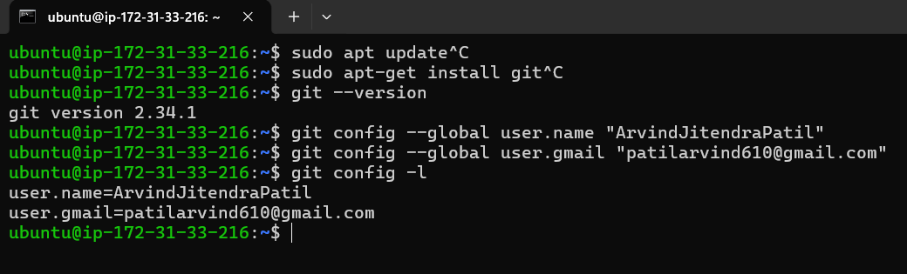
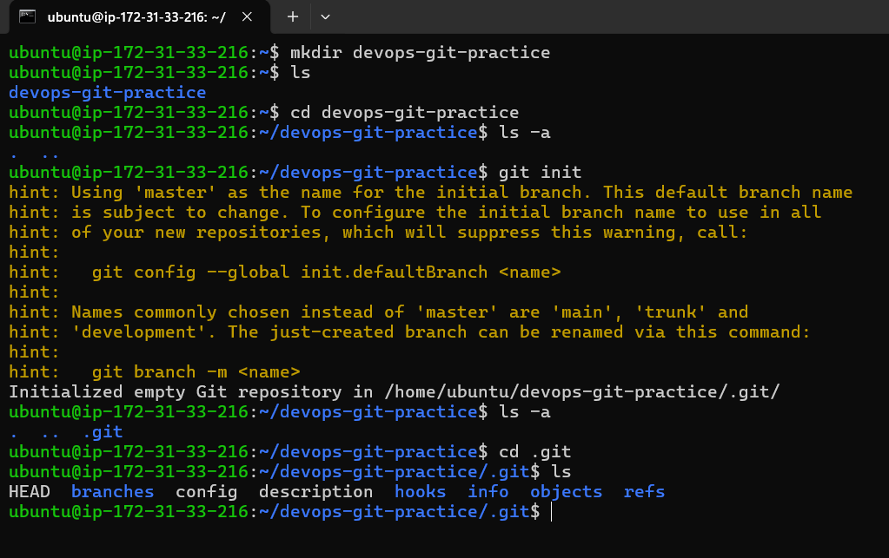
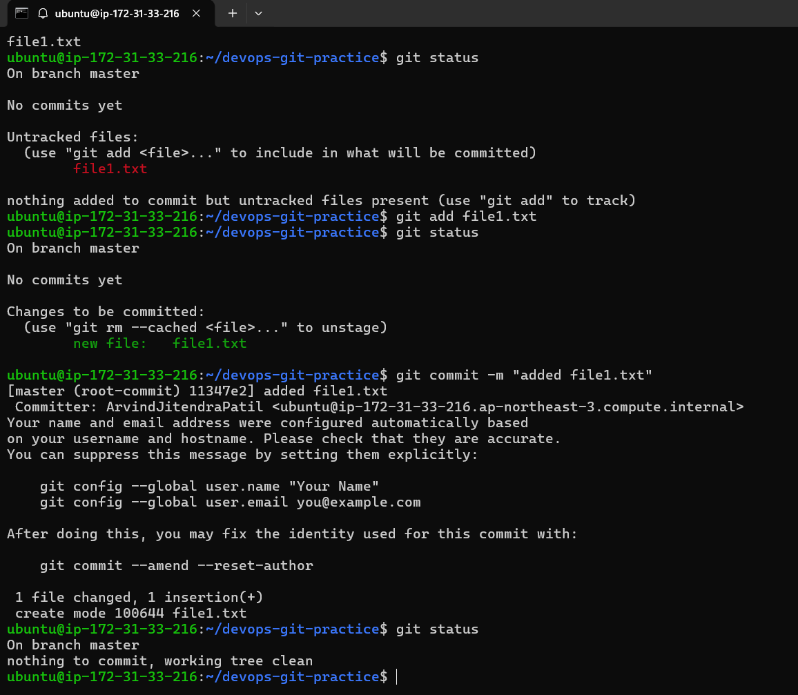
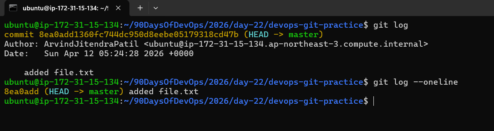

## Day 22 – Introduction to Git: Your First Repository
## What is git?
Git is a distributed version control system used to manage code history and enable team collaboration.

## Task 1: Install and Configure Git
1. Verify Git is installed on your machine
2. Set up your Git identity — name and email
3. Verify your configuration

---

## Task 2: Create Your Git Project
1. Create a new folder called `devops-git-practice`
2. Initialize it as a Git repository
3. Check the status — read and understand what Git is telling you
4. Explore the hidden `.git/` directory — look at what's inside

---

## Task 3: Create Your Git Commands Reference
1. Create a file called `git-commands.md` inside the repo
2. Add the Git commands you've used so far, organized by category:
   - **Setup & Config**
   - **Basic Workflow**
   - **Viewing Changes**
3. For each command, write:
   - What it does (1 line)
   - An example of how to use it

---

## Task 4: Stage and Commit
1. Stage your file
2. Check what's staged
3. Commit with a meaningful message
4. View your commit history

   
---

## Task 5: Make More Changes and Build History
1. Edit `git-commands.md` — add more commands as you discover them
2. Check what changed since your last commit
3. Stage and commit again with a different, descriptive message
4. Repeat this process at least **3 times** so you have multiple commits in your history
5. View the full history in a compact format

   
---

## Task 6: Understand the Git Workflow

1. What is the difference between `git add` and `git commit`?
* `git add`- keeps file in staging area. So it can be included in next commit.
* `git commit` - Commits staged changes into the repository history with a message. Creates a new commit with commit id.
 
2. What does the **staging area** do? Why doesn't Git just commit directly?
* Staging area stores files/changes that need to be added in next commit. 
 What if I accidentally added something, and it gets committed(ex:private key).That is why staging is needed,
 So if I added something mistakenly it can be unstaged without any mess.
 Also we can commit multiple changes with single commit.
 
3. What information does `git log` show you?
* `git log` - shows commit history.

4. What is the `.git/` folder and what happens if you delete it?
* `.git/` - git folder stores the complete history of your repository, holds config file, hooks.
 If you delete .git folder, your project history is gone. Nothing can be tracked. It basically becomes normal directory.

5. What is the difference between a **working directory**, **staging area**, and **repository**?
* **working directory** - It is your project directory. Where you write files. Changes here are not tracked until you add,commit.
* **staging area** - After adding files to staging area it can be committed and traced.
* **repository** - All your commites, branches is your repository. Basically history of your working directory
     with version control.

---
