# Day 30 – Docker Images & Container Lifecycle

## Task 1: Docker Images
1. Pull the `nginx`, `ubuntu`, and `alpine` images from Docker Hub
     * docker pull <image>
   
2. List all images on your machine — note the sizes  
   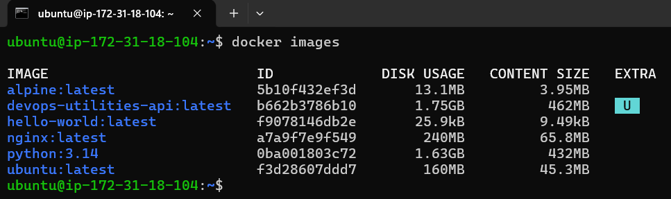

3. Compare `ubuntu` vs `alpine` — why is one much smaller?
     * Ubuntu - Larger image size because it includes many built‑in tools, libraries, and GNU utilities.
     * Alpine - Smaller image size since it contains fewer tools and libraries by default.

4. Inspect an image — what information can you see?  
   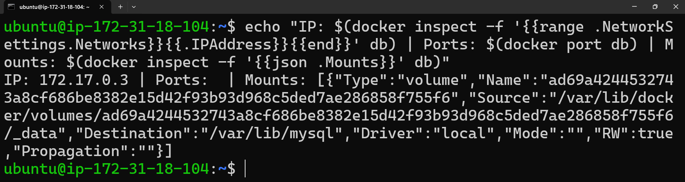

5. Remove an image you no longer need  
   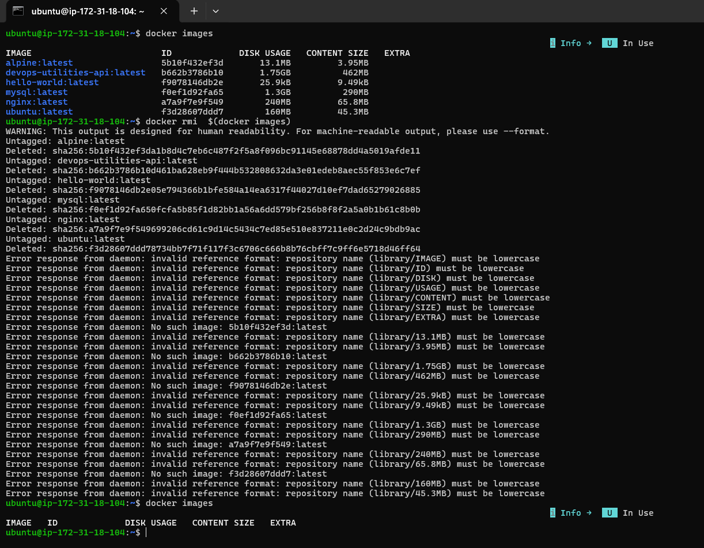
     
---

## Task 2: Image Layers
1. Run `docker image history nginx` — what do you see?
2. Each line is a **layer**. Some show sizes, some 0B.
3. Write in your notes: What are layers and why does Docker use them?  
   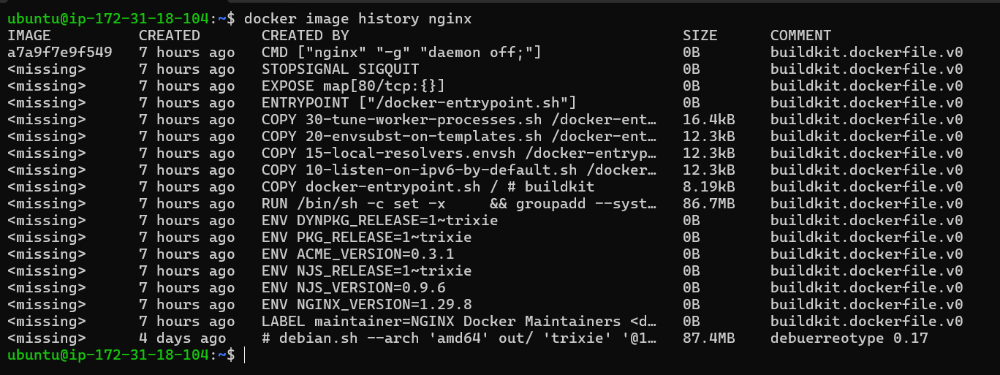
    
---

## Task 3: Container Lifecycle
Practice the full lifecycle on one container:
- Create → Start → Pause → Unpause → Stop → Restart → Kill → Remove  

Check `docker ps -a` after each step.  
   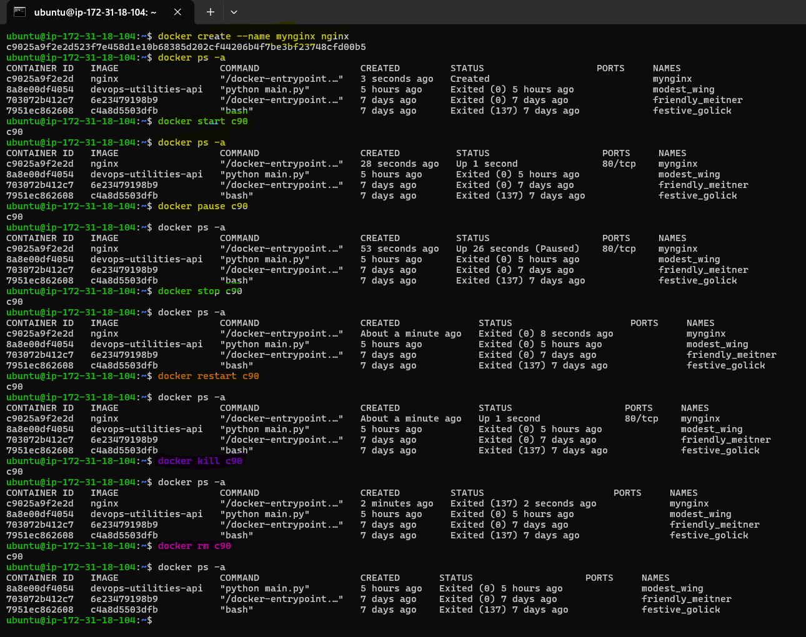  
   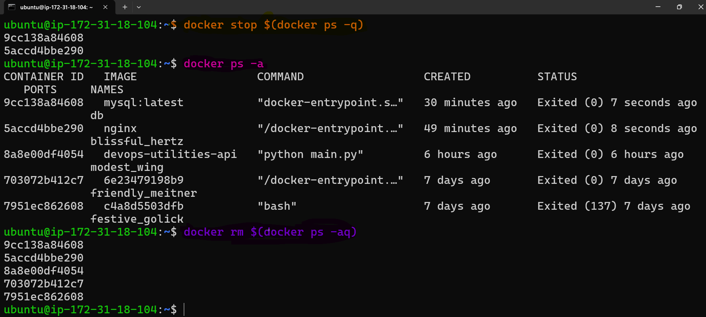
    
---

## Task 4: Working with Running Containers
1. Run an Nginx container in detached mode  
   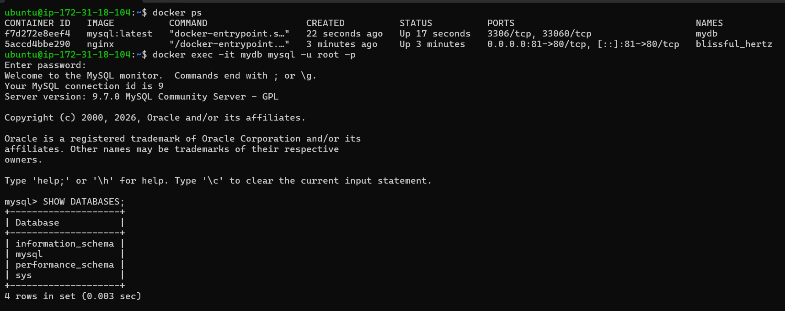

2. View logs  
   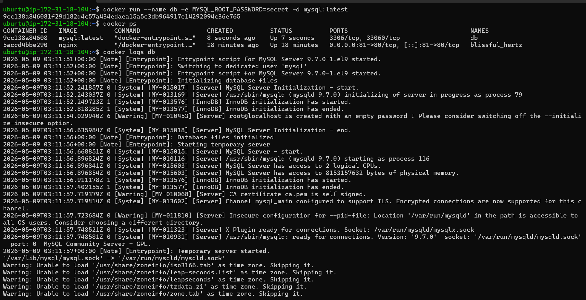
    
---

## Task 5: Cleanup
1. Stop all running containers  

2. Remove all stopped containers  

3. Using prune  
   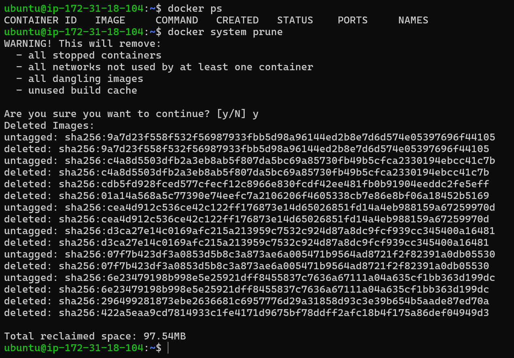

4. Remove unused images  
   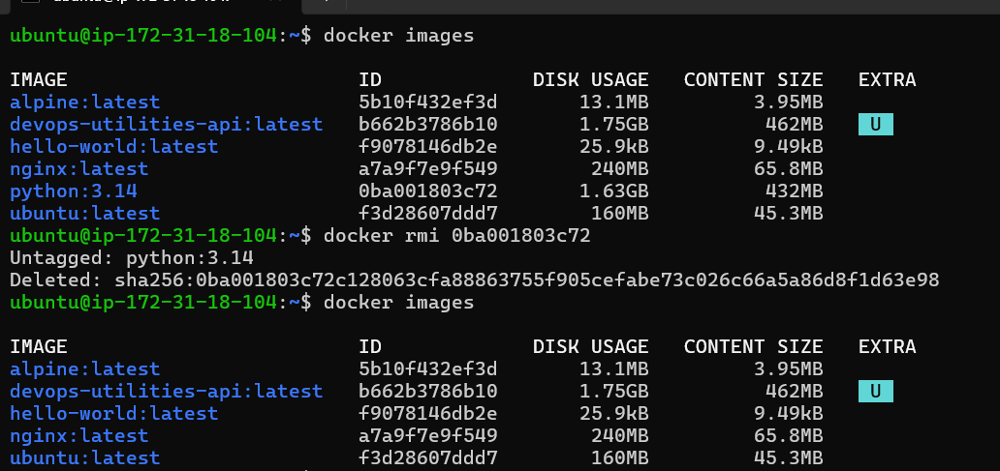

5. Check Docker disk usage  
   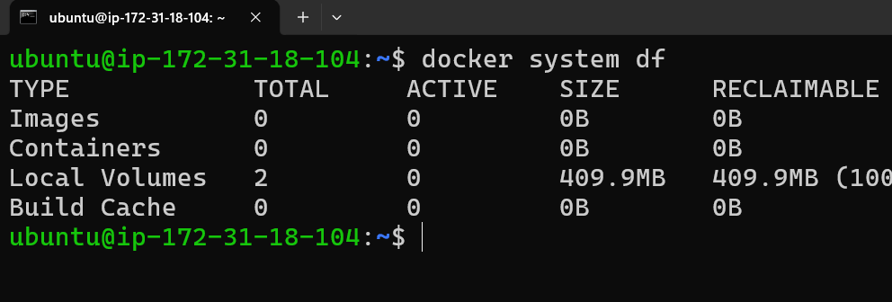
