# Day 35 – Multi-Stage Builds & Docker Hub

## Task 1: The Problem with Large Images

### Objective

Understand why single-stage Docker images are large.

### Activities Performed

* Created a simple Node.js Express application.
* Initialized the project using npm.
* Installed Express dependency.
* Created a single-stage Dockerfile using `node:18`.
* Built the image.
* Ran the container.
* Measured image size.

### Commands Used

```bash
sudo apt update
sudo apt install nodejs npm -y

docker build -f Dockerfile.single-stage -t single-stage-node .

docker run -d -p 8080:3000 single-stage-node

docker images
```

### Result

| Image             | Size   |
| ----------------- | ------ |
| single-stage-node | 1.58 GB |

### Observation

The image size was large because it contained:

* Build dependencies
* Development tools
* Runtime files
* Extra layers

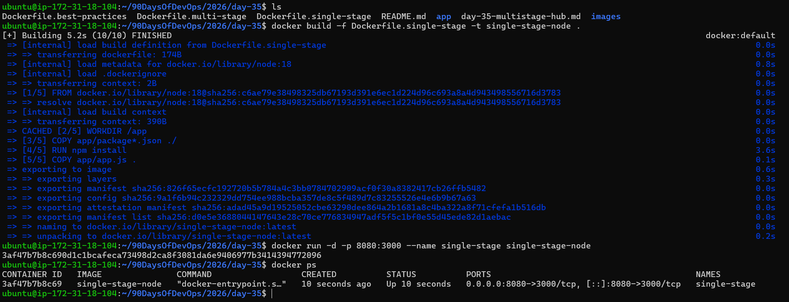
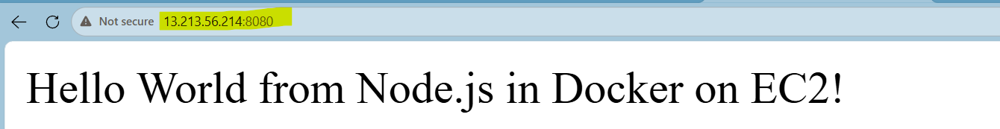

---

# Task 2: Multi-Stage Build

### Objective

Reduce Docker image size using Multi-Stage Builds.

### Activities Performed

* Created `Dockerfile.multi-stage`.
* Used a builder stage.
* Used a lightweight runtime stage based on `node:18-alpine`.
* Copied only required application files.
* Built the optimized image.
* Ran the container.
* Compared image sizes.

### Commands Used

```bash
docker build -f Dockerfile.multi-stage -t multi-stage-node .

docker run -d -p 8081:3000 multi-stage-node

docker images
```

### Result

| Image            | Size  |
| ---------------- | ----- |
| multi-stage-node | ~80MB |

### Learning

Multi-stage builds remove unnecessary build tools and dependencies from the final image, resulting in significantly smaller images.

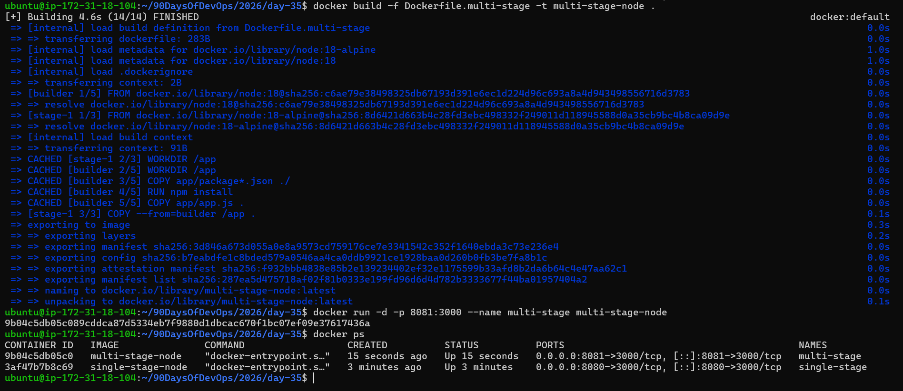
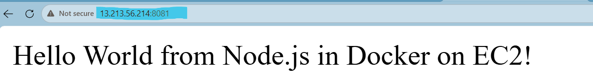

---

# Task 3: Push to Docker Hub

### Objective

Publish the optimized image to Docker Hub.

### Activities Performed

* Logged into Docker Hub.
* Tagged the image.
* Pushed the image.
* Verified by pulling the image.

### Commands Used

```bash
docker login

docker tag multi-stage-node arvindjitendrapatil/multi-stage-node:1.0

docker push arvindjitendrapatil/multi-stage-node:1.0

docker pull arvindjitendrapatil/multi-stage-node:1.0
```

### Result

✅ Login Successful

✅ Image Pushed Successfully

✅ Image Pulled Successfully

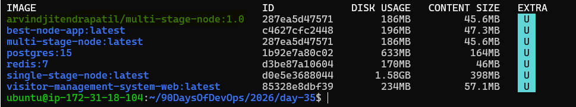
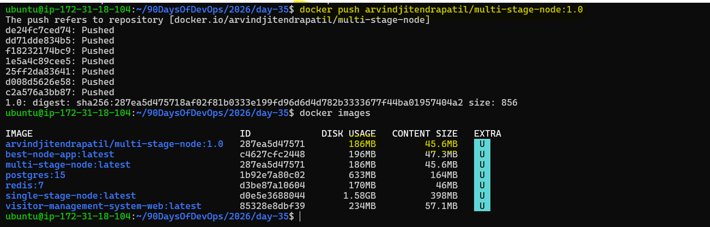
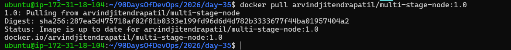

---

# Task 4: Docker Hub Repository

### Objective

Explore Docker Hub repository management and tagging.

### Activities Performed

* Opened Docker Hub repository.
* Added repository description.
* Explored Tags section.
* Pulled a specific version tag.
* Tested pulling the latest tag.

### Commands Used

```bash
docker pull arvindjitendrapatil/multi-stage-node:1.0

docker pull arvindjitendrapatil/multi-stage-node:latest
```

### Observation

* Tag `1.0` was successfully available.
* `latest` tag was not found because it was never pushed.

### Learning

Docker only creates tags that are explicitly pushed.

Version tags provide predictable deployments.

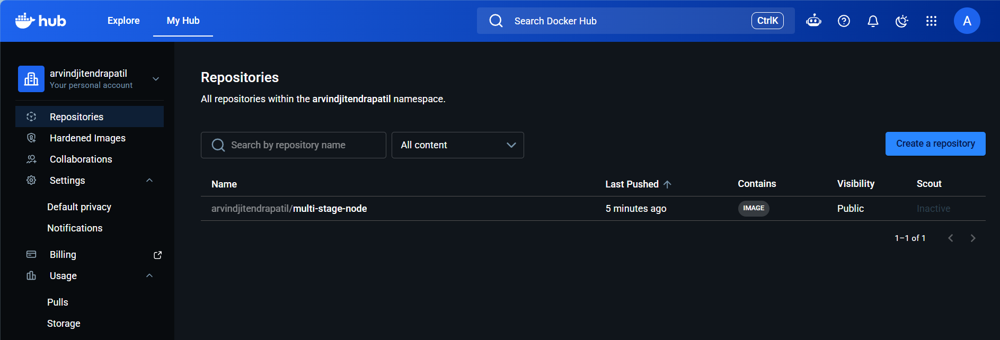
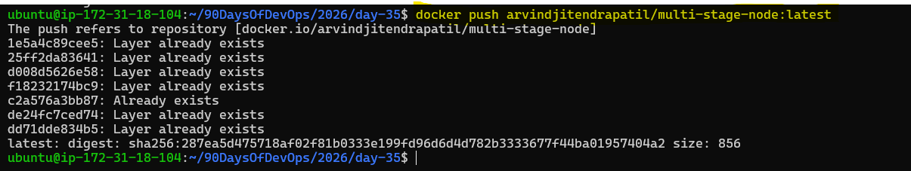
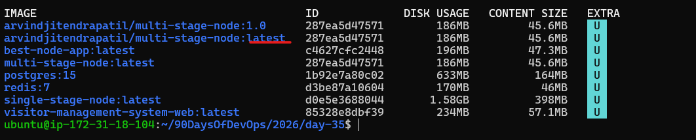

---

# Task 5: Image Best Practices

### Objective

Create a secure production-ready Docker image.

### Activities Performed

* Created `Dockerfile.best-practices`.
* Used Alpine base image.
* Installed production dependencies only.
* Added non-root user.
* Built and ran the optimized image.

### Commands Used

```bash
docker build -f Dockerfile.best-practices -t best-node-app .

docker run -d -p 8082:3000 best-node-app
```

### Result

| Image         | Size  |
| ------------- | ----- |
| best-node-app | ~70MB |

### Best Practices Applied

✅ Minimal Base Image

✅ Non-Root User

✅ Production Dependencies Only

✅ Smaller Attack Surface

✅ Better Security

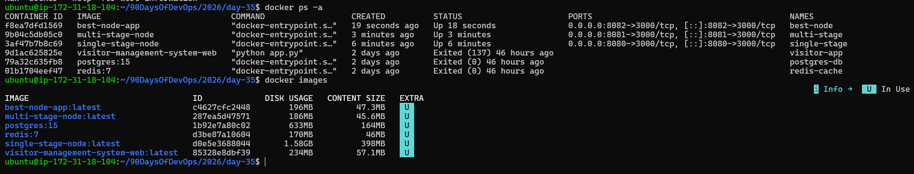
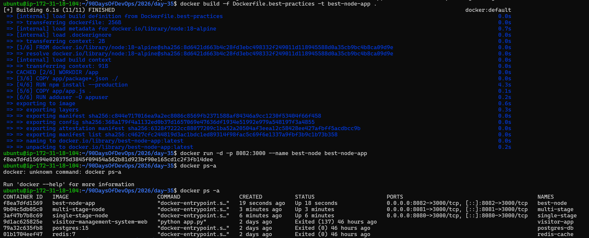
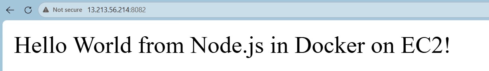

---

# Results Comparison

| Build Type     | Approx Size | Notes                        |
| -------------- | ----------- | ---------------------------- |
| Single-Stage   | ~900MB      | Large image with build tools |
| Multi-Stage    | ~80MB       | Runtime-only optimized image |
| Best Practices | ~70MB       | Secure and production-ready  |

---

# Key Learnings

* Multi-stage builds drastically reduce image size.
* Docker Hub enables image sharing and versioning.
* Docker tags must be pushed explicitly.
* Alpine images help create lightweight containers.
* Non-root containers improve security.

---

# Git Commands

```bash
git add .

git commit -m "Day 35: Multi-stage builds & Docker Hub"

git push origin master
```

---

# Conclusion

Successfully completed all Day 35 tasks by building, optimizing, securing, and publishing Docker images while learning Docker Hub versioning and image best practices.

#90DaysOfDevOps #Docker #DockerHub #MultiStageBuilds #DevOpsKaJosh #TrainWithShubham
