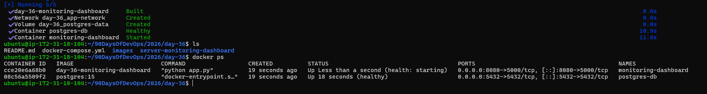
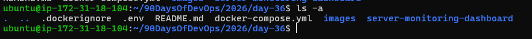
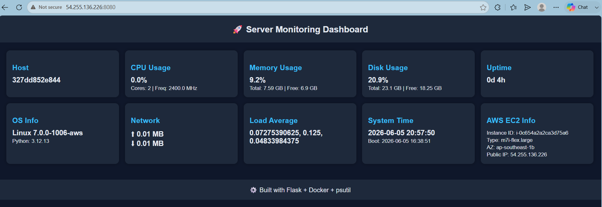
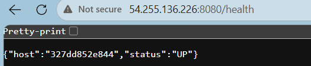
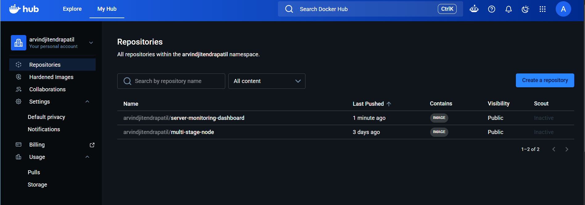
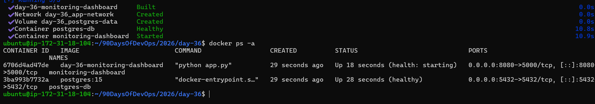
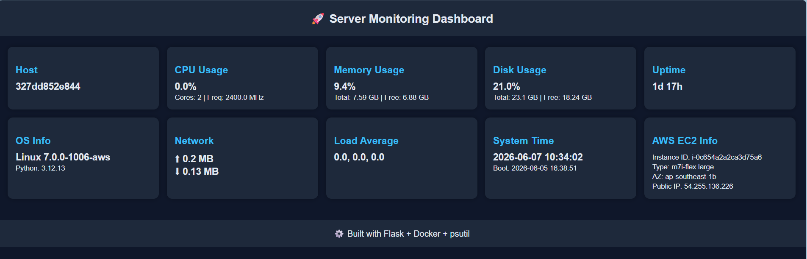

# Day 36 – Docker Project: Dockerize a Full Application 🚀

## Project Overview

For Day 36, I Dockerized a real-world **Server Monitoring Dashboard** built with Python Flask. The application monitors server resources such as CPU usage, Memory usage, Disk usage, Network statistics, System uptime, and AWS EC2 metadata.

The objective was to package the application into containers, manage services using Docker Compose, and deploy it in a production-like environment on AWS EC2.

---

# Task 1: Pick Your App

## Application Chosen

**Server Monitoring Dashboard**

## Why I Chose This Application

Monitoring is a critical responsibility in DevOps and Site Reliability Engineering. I wanted to build something practical that could provide visibility into infrastructure health while also giving me hands-on experience with Docker and cloud deployment.

### Features

* CPU Monitoring
* Memory Monitoring
* Disk Usage Tracking
* Network Statistics
* System Uptime
* Load Average
* AWS EC2 Metadata
* Responsive Dashboard UI

### Technology Stack

* Python 3.12
* Flask
* psutil
* Docker
* Docker Compose
* PostgreSQL
* AWS EC2
* Linux




---

# Task 2: Dockerfile Creation

## Dockerfile

```dockerfile
FROM python:3.12-slim

WORKDIR /app

COPY app/requirements.txt .

RUN pip install --no-cache-dir --upgrade pip && \
    pip install --no-cache-dir -r requirements.txt

COPY app/ .

RUN useradd -m appuser

USER appuser

EXPOSE 5000

CMD ["python", "app.py"]
```

## Dockerfile Explanation

### FROM python:3.12-slim

Uses a lightweight Python image to reduce image size.

### WORKDIR /app

Sets the working directory inside the container.

### COPY app/requirements.txt .

Copies dependency file first to leverage Docker layer caching.

### RUN pip install

Installs application dependencies.

### COPY app/ .

Copies application source code into the container.

### RUN useradd -m appuser

Creates a non-root user for security.

### USER appuser

Runs the container using a non-root user.

### EXPOSE 5000

Makes Flask application available on port 5000.

### CMD ["python", "app.py"]

Starts the Flask application.

---

## .dockerignore

```text
__pycache__
*.pyc
*.pyo
.git
.gitignore
.env
venv
```

### Benefits

* Faster builds
* Smaller image size
* Better security
* Reduced build context

---

# Task 3: Docker Compose Setup

## Environment Variables

```env
APP_PORT=5000

POSTGRES_USER=admin
POSTGRES_PASSWORD=admin123
POSTGRES_DB=monitoring
```

## Docker Compose Features Implemented

### Application Service

* Flask monitoring application

### Database Service

* PostgreSQL container

### Persistent Storage

* Docker volumes for database persistence

### Networking

* Custom Docker network for service communication

### Environment Variables

* Configuration managed through .env file

### Health Checks

* PostgreSQL health monitoring




---

# Task 4: Ship It

## Build Image

```bash
docker build -t server-monitoring-dashboard:1.0 .
```

## Tag Image

```bash
docker tag server-monitoring-dashboard:1.0 <dockerhub-username>/server-monitoring-dashboard:1.0
```

## Push Image

```bash
docker push <dockerhub-username>/server-monitoring-dashboard:1.0
```

## README Created

The README contains:

* Project Overview
* Features
* Prerequisites
* Docker Compose Setup
* Environment Variables
* Running Instructions
* Troubleshooting Guide

---

# Task 5: End-to-End Testing

To validate the deployment process, I tested the entire workflow from scratch.

## Cleanup

```bash
docker compose down -v
docker system prune -af
```

## Fresh Deployment

```bash
docker compose up -d --build
```

## Validation

### Verified:

* Application container starts successfully
* Database container starts successfully
* Environment variables load correctly
* Dashboard accessible through browser
* Monitoring metrics display properly
* Docker networking functions correctly
* Persistent storage works as expected





---

# Challenges Faced

## Challenge 1: Container Security

Running containers as root is not recommended.

### Solution

Created a dedicated non-root user inside the Docker image.

---

## Challenge 2: Managing Dependencies

Dependency installation increased build time.

### Solution

Used Docker layer caching by copying requirements.txt before application code.

---

## Challenge 3: Environment Configuration

Managing configuration across environments.

### Solution

Used .env files with Docker Compose.

---

## Challenge 4: Service Communication

Application needed communication with supporting services.

### Solution

Configured Docker networking through Docker Compose.

---

# Project Structure

```text
day-36/
├── README.md
├── day-36-docker-project.md
├── docker-compose.yml
├── images/
└── server-monitoring-dashboard/
    ├── Dockerfile
    └── app/
```

---

# Final Results

| Component             | Status        |
| --------------------- | ------------- |
| Dockerfile            | ✅ Completed   |
| Docker Compose        | ✅ Completed   |
| Non-Root User         | ✅ Implemented |
| Environment Variables | ✅ Configured  |
| Database Integration  | ✅ Completed   |
| AWS EC2 Deployment    | ✅ Completed   |
| Monitoring Dashboard  | ✅ Running     |
| Documentation         | ✅ Completed   |

---

# Key Learnings

* Docker image optimization
* Container security best practices
* Docker Compose orchestration
* Environment variable management
* AWS EC2 deployment
* Monitoring application containerization
* Real-world DevOps workflows

## Conclusion

Successfully Dockerized a Flask-based Server Monitoring Dashboard, orchestrated services using Docker Compose, and deployed the application on AWS EC2. This project provided hands-on experience with containerization, service orchestration, infrastructure monitoring, and production deployment practices.

