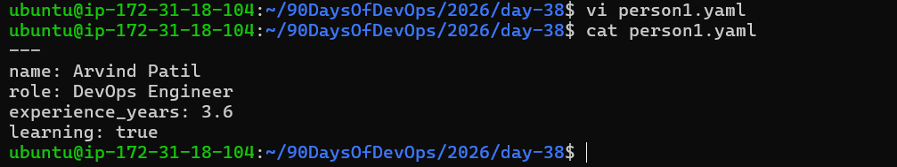
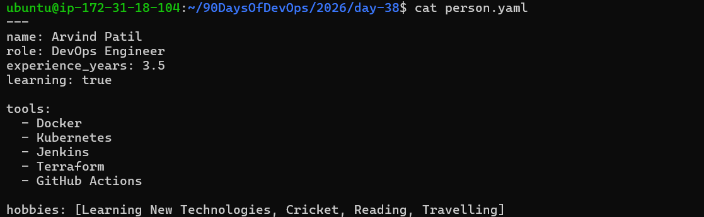
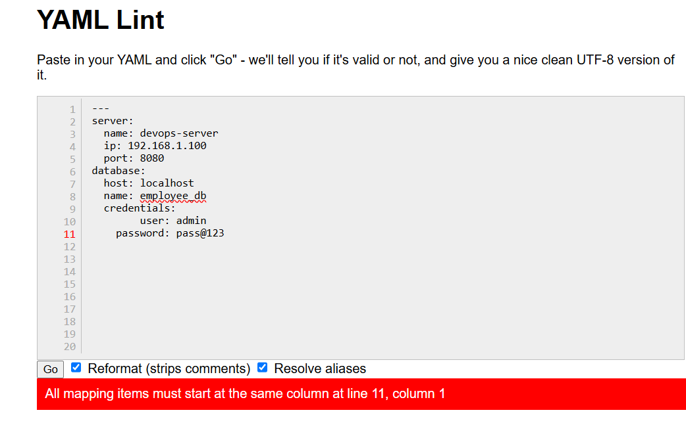
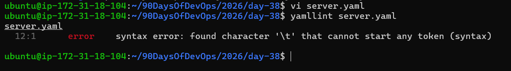
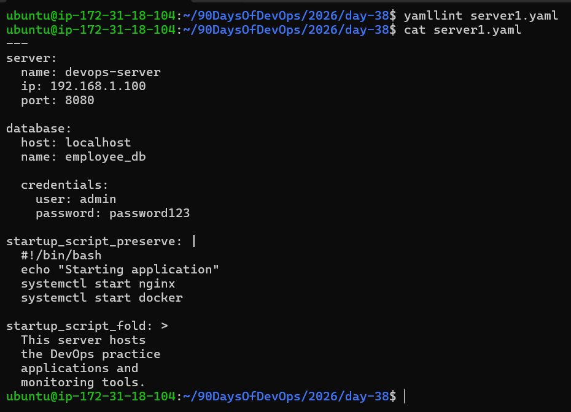
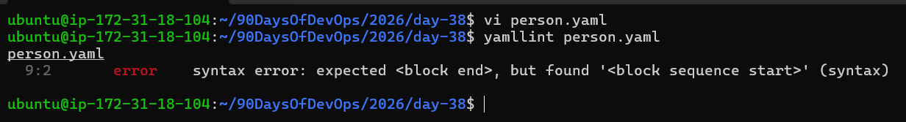
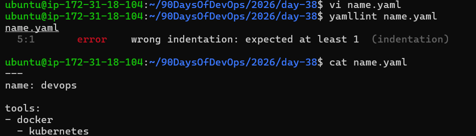
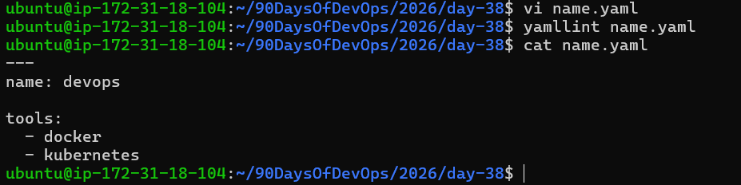

# Day 38 - YAML Basics

## Task 1 - Key Value Pairs

Created person.yaml with:

* name
* role
* experience_years
* learning



## Task 2 - Lists

Added:

### Block Style List

```yaml
tools:
  - Docker
  - Kubernetes
  - Jenkins
  - Terraform
  - GitHub Actions
```

### Inline Style List

```yaml
hobbies: [Learning New Technologies, Cricket, Reading, Travelling]
```
 

## Task 3 - Nested Objects

Created server.yaml with nested:

* server
* database
* credentials

  


## Task 4 - Multi-line Strings

Used:

### Pipe Style

```yaml
startup_script_preserve: |
```

Preserves line breaks.

### Fold Style

```yaml
startup_script_fold: >
```

Converts multiple lines into a single line.



## Task 5 - YAML Validation

Validated files using:

```bash
yamllint person.yaml
yamllint server.yaml
```

Fixed indentation errors and revalidated successfully.



## Task 6 - Spot the Difference

Incorrect indentation caused YAML parsing errors.

Correct YAML requires consistent spacing.

  



## What I Learned

1. YAML is indentation-sensitive and uses spaces only.
2. Lists can be written in block style or inline style.
3. The `|` operator preserves new lines while `>` folds lines into a single paragraph.

