# Day 40 – Your First GitHub Actions Workflow

## Objective

Create and run your first GitHub Actions workflow to understand the basics of CI/CD automation.

---

# Task 1: Repository Setup

## Steps Performed

Created a new public repository:

```bash
github-actions-practice
```

Cloned the repository locally:

```bash
git clone https://github.com/ArvindJitendraPatil/github-actions-practice.git
cd github-actions-practice
```

Created the workflow directory:

```bash
mkdir -p .github/workflows
```
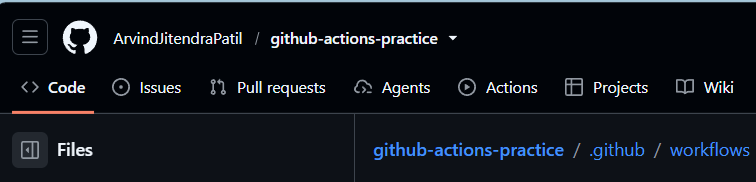 

### Output

Repository structure ready for GitHub Actions workflows.


---

# Task 2: Hello Workflow

Created the workflow file:

**.github/workflows/hello.yml**

```yaml
name: Hello

on:
  push:
    branches:
      - main

jobs:
  greet:
    runs-on: ubuntu-latest

    steps:
      - name: Checkout Code
        uses: actions/checkout@v4

      - name: Print Message
        run: echo "Hello from GitHub Actions!"
```

## Verification

* Pushed code to GitHub
* Opened the Actions tab
* Workflow executed automatically
* Pipeline completed successfully (Green ✅)

### Screenshot

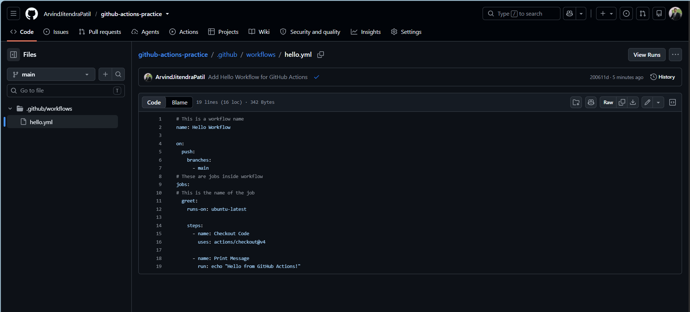  
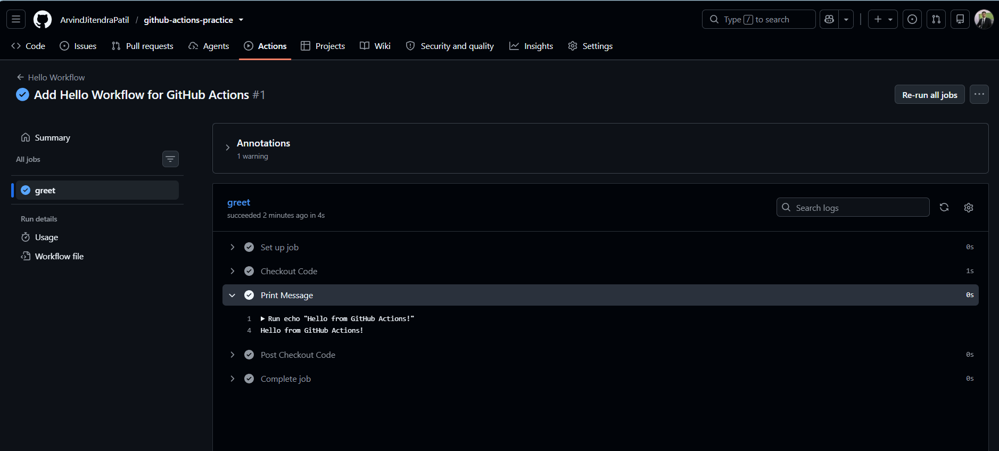

---

# Task 3: Understand Workflow Anatomy

## on:

Defines the event that triggers the workflow.

```yaml
on:
  push
```

## jobs:

Contains one or more jobs to execute.

```yaml
jobs:
```

## runs-on:

Specifies the operating system used by the runner.

```yaml
runs-on: ubuntu-latest
```

## steps:

Sequence of tasks executed by the runner.

```yaml
steps:
```

## uses:

Runs a reusable GitHub Action.

```yaml
uses: actions/checkout@v4
```

## run:

Executes shell commands.

```yaml
run: echo "Hello"
```

## name:

Provides a readable name for workflows and steps.

```yaml
name: Checkout Code
```

---

# Task 4: Add More Steps

Updated workflow:

```yaml
name: Hello Workflow

on:
  push:
    branches:
      - main

jobs:
  greet:
    runs-on: ubuntu-latest

    steps:
      - name: Checkout Code
        uses: actions/checkout@v4

      - name: Print Hello Message
        run: echo "Hello from GitHub Actions!"

      - name: Print Date and Time
        run: date

      - name: Print Branch Name
        run: 'echo "Branch: ${{ github.ref_name }}"'

      - name: List Repository Files
        run: ls -la

      - name: Print Runner OS
        run: 'echo "Operating System: $RUNNER_OS"'
```

## Output Observed

* Displayed current date and time
* Displayed branch name
* Listed repository files
* Displayed runner operating system (Linux)

### Screenshot

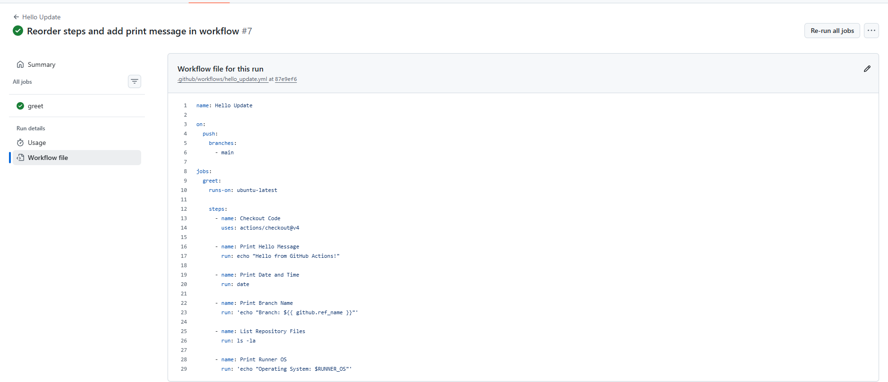
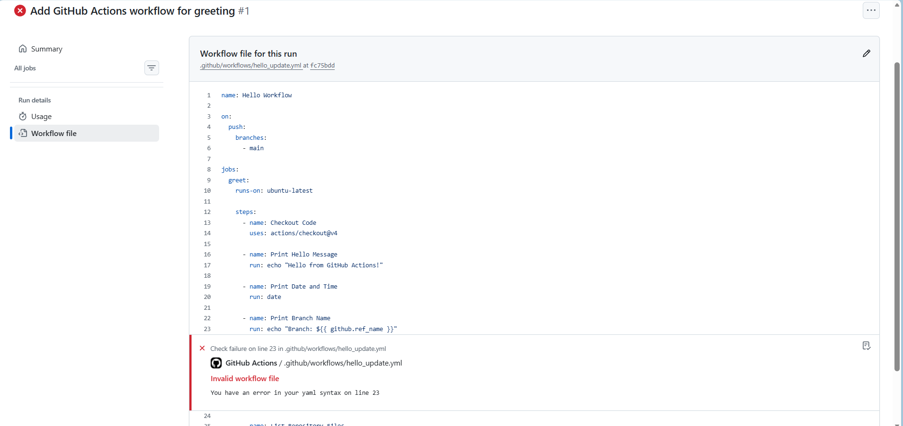  
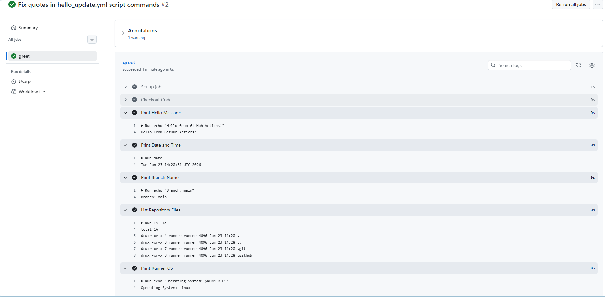

---

# Task 5: Break It On Purpose

```yaml

# This is a workflow name
name: Hello failed

on:
  push:
    branches:
      - main
# on:
  # workflow_dispatch:
jobs:
  greet:
    runs-on: ubuntu-latest

    steps:
      - name: Checkout Code
        uses: actions/checkout@v4

      - name: Print Hello Message
        run: echo "Hello from GitHub Actions!"

      - name: Intentional Failure
        run: exit 1

```
### Screenshot

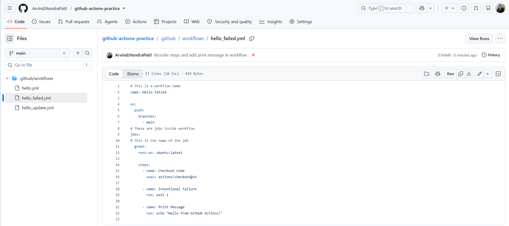
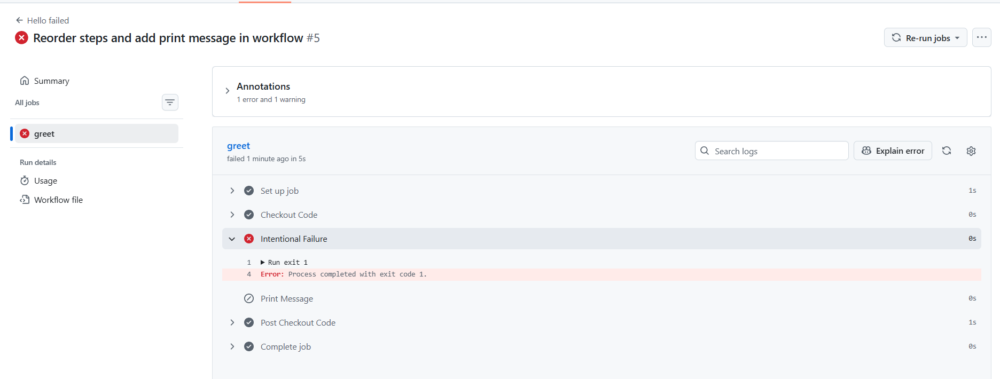  
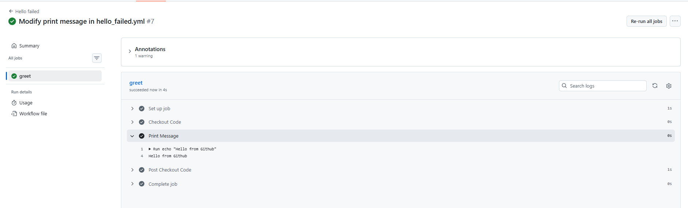
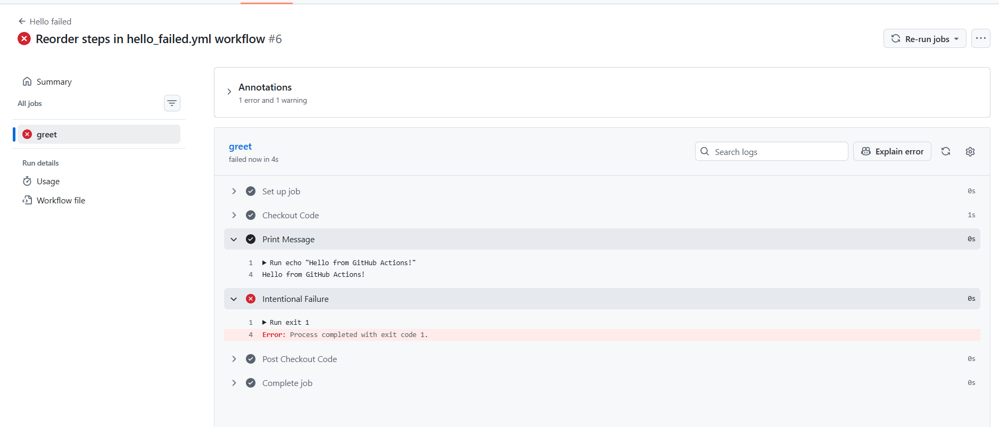  
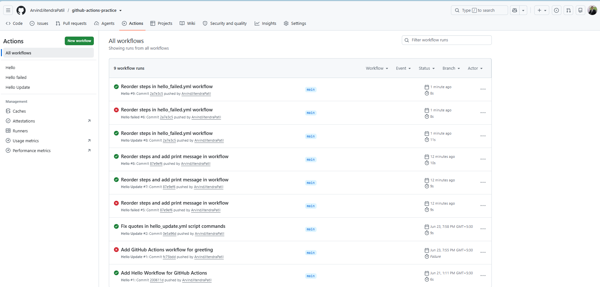

## Observation

* Workflow failed
* Red ❌ appeared in Actions tab
* Error logs showed the failed command

## How to Read Errors

1. Open Actions tab
2. Select failed workflow run
3. Open failed job
4. Expand failed step
5. Review logs and exit code

## What Does a Failed Pipeline Look Like?

* Red ❌ status
* Workflow marked as Failed
* Error highlighted in logs
* Exit code indicates failure reason

## Fix

Removed the failing command and pushed again.

### Result

Workflow passed successfully (Green ✅)
---

# Key Learnings

* Learned the basics of GitHub Actions.
* Created and executed a workflow.
* Understood workflow syntax and structure.
* Used GitHub-hosted runners.
* Learned how to debug failed pipelines.
* Gained practical CI/CD experience.
