# Day 41 – Triggers & Matrix Builds

## Challenge Tasks

### Task 1: Trigger on Pull Request
1. Create `.github/workflows/pr-check.yml`
2. Trigger it only when a pull request is **opened or updated** against `main`
3. Add a step that prints: `PR check running for branch: <branch name>`
4. Create a new branch, push a commit, and open a PR
5. Watch the workflow run automatically

[Hello Workflow](workflows/hello.yml) 
[PR Check Workflow](workflows/pr-check.yml) 

**Verify:** Does it show up on the PR page?
   - Yes,it show up on the PR page

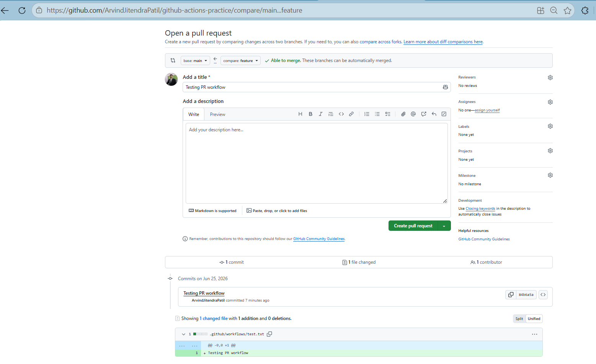  
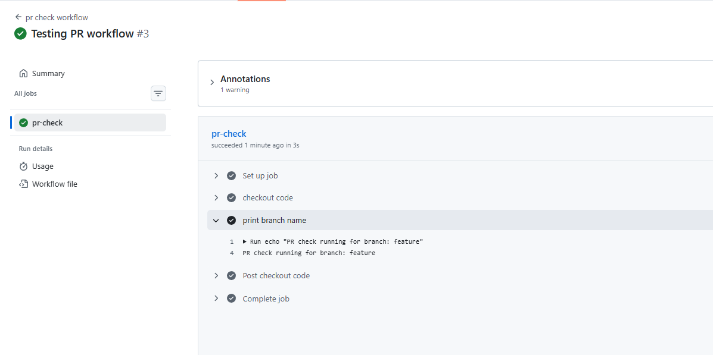  
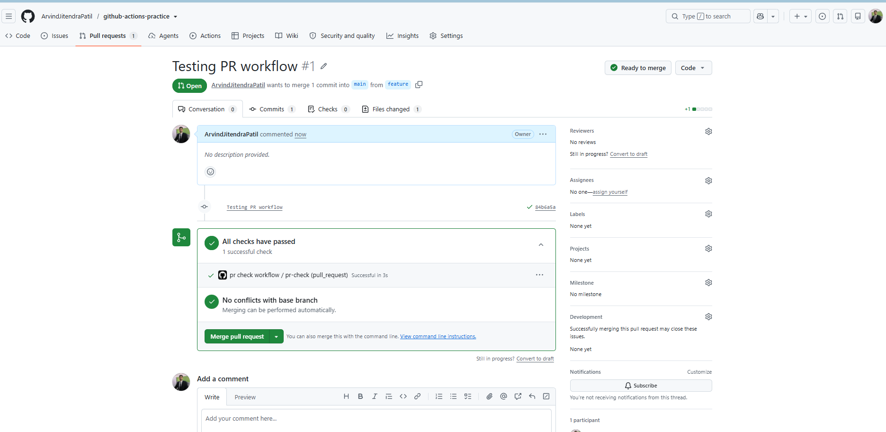

---

### Task 2: Scheduled Trigger
1. Add a `schedule:` trigger to any workflow using cron syntax
2. Set it to run every day at midnight UTC
3. What is the cron expression for every Monday at 9 AM?

[Schedule Workflow](workflows/schedule.yml)  
   
- cron expression for every Monday at 9 AM is `0 9 * * 1`

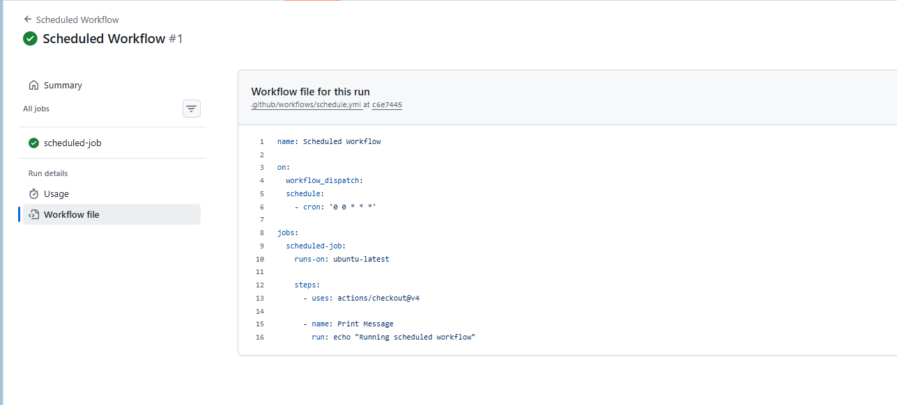  
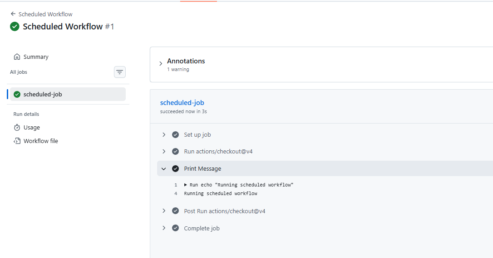 

---

### Task 3: Manual Trigger
1. Create `.github/workflows/manual.yml` with a `workflow_dispatch:` trigger
2. Add an **input** that asks for an `environment` name (staging/production)
3. Print the input value in a step
4. Go to the **Actions** tab → find the workflow → click **Run workflow**

[Manual Workflow](workflows/manual.yml)  

**Verify:** Can you trigger it manually and see your input printed?
   - Yes, I see input value.

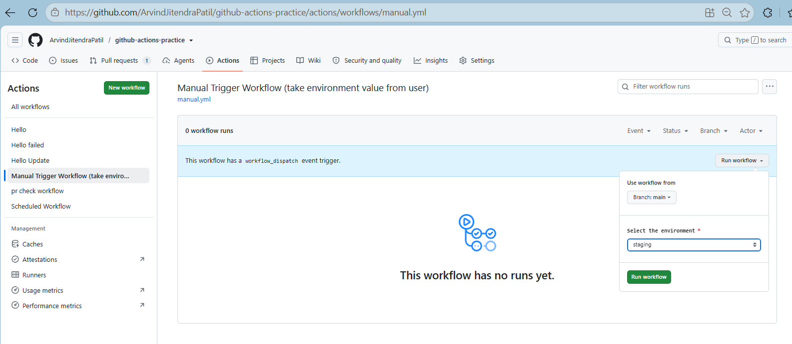  
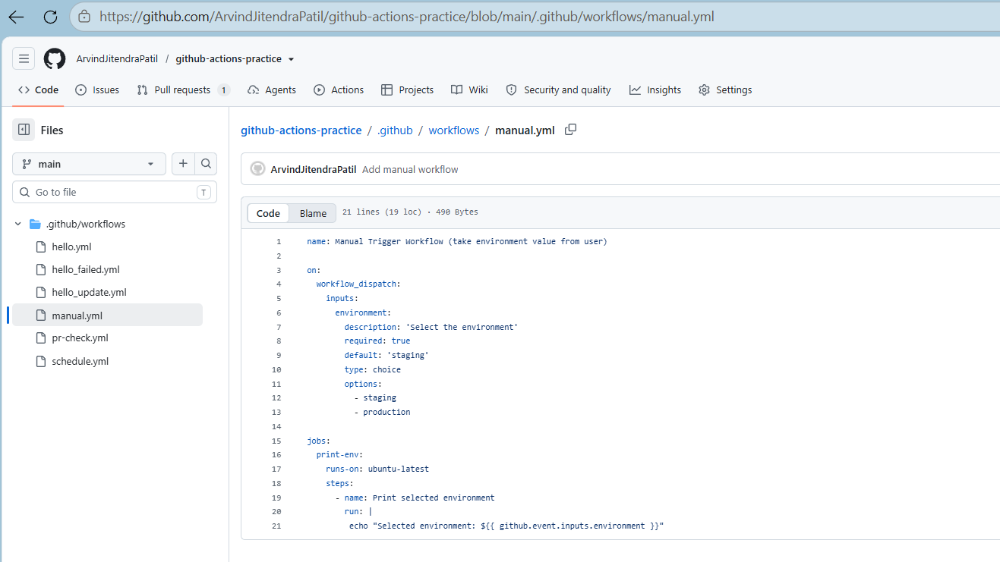  
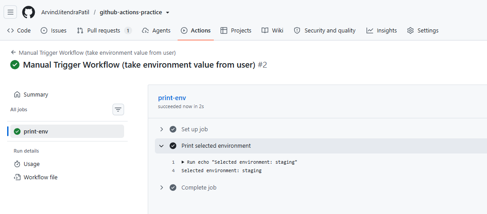  
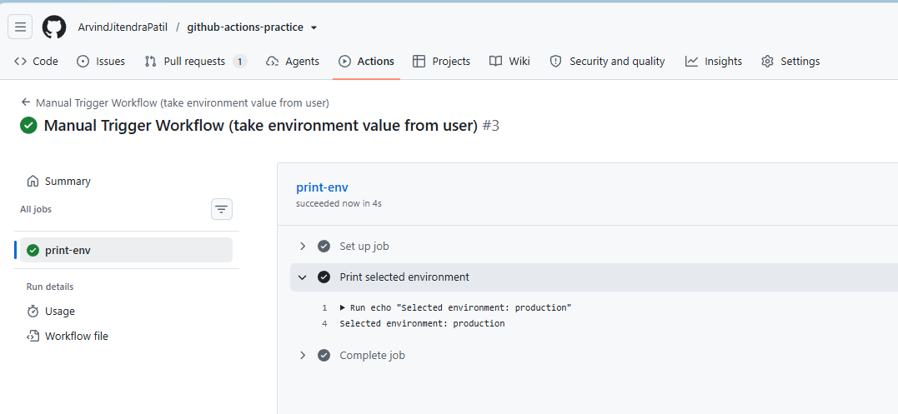   

---

### Task 4: Matrix Builds
Create `.github/workflows/matrix.yml` that:
1. Uses a matrix strategy to run the same job across:
   - Python versions: `3.10`, `3.11`, `3.12`
2. Each job installs Python and prints the version
3. Watch all 3 run in parallel

[Matrix Workflow](workflows/matrix.yml)  
 
[Python Matrix Workflow](workflows/python-matrix.yml) 

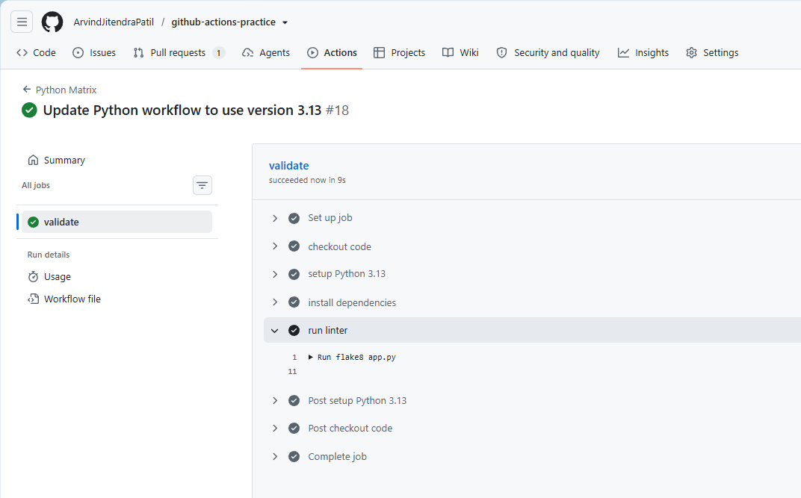  
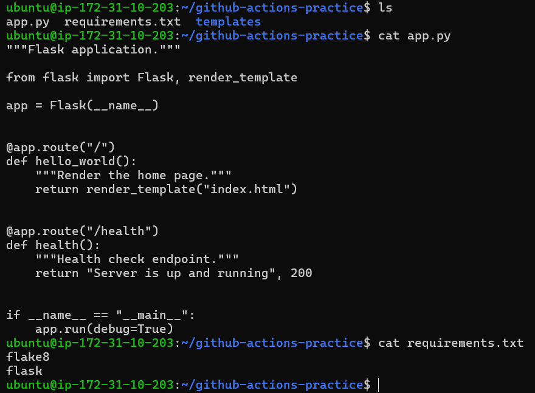  
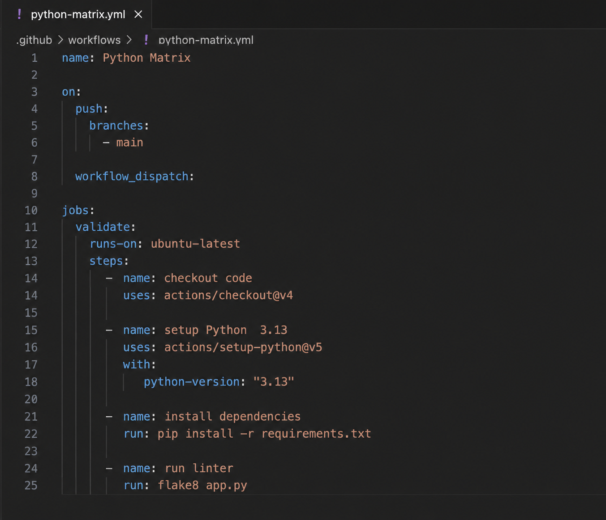  
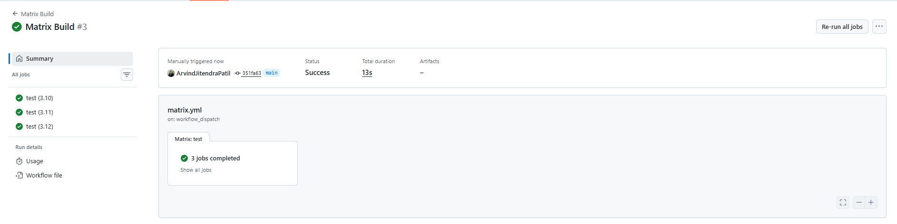  
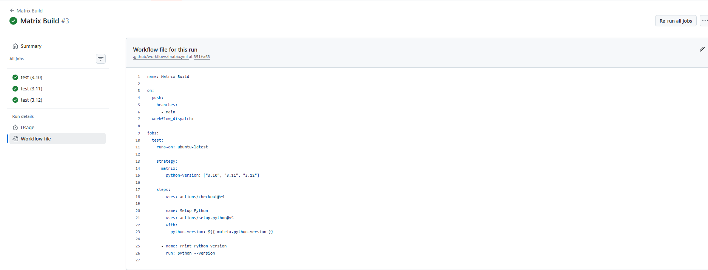

Then extend the matrix to also include 2 operating systems — how many total jobs run now?

[Matrix OS Workflow](workflows/matrixos.yml) 

- Total 6 jobs are run

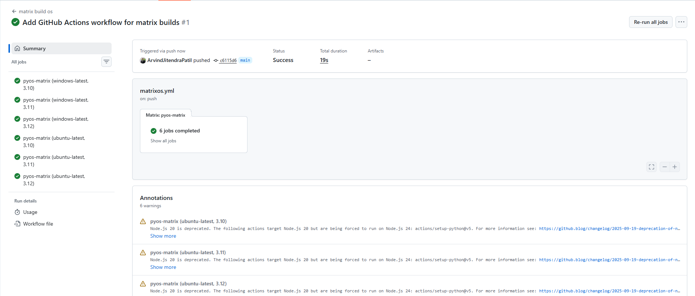  
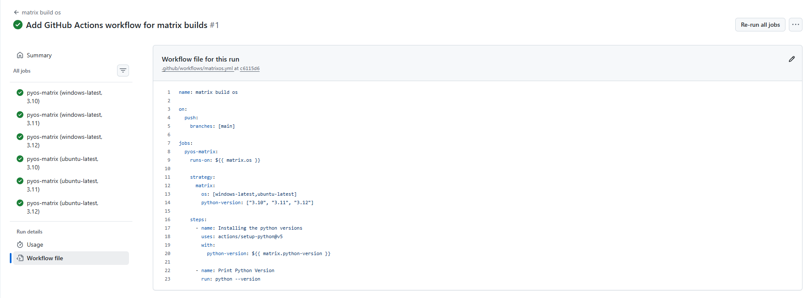 

---

### Task 5: Exclude & Fail-Fast
1. In your matrix, **exclude** one specific combination (e.g., Python 3.10 on Windows)
2. Set `fail-fast: false` — trigger a failure in one job and observe what happens to the rest
3. Write in your notes: What does `fail-fast: true` (the default) do vs `false`?

[Matrix Advanced Workflow](workflows/Matrix_Advanced.yml)  

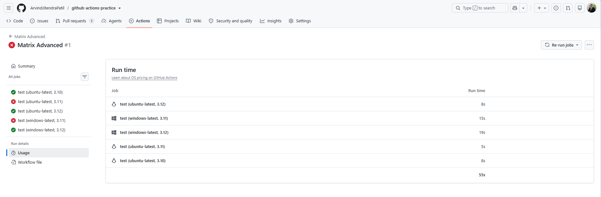

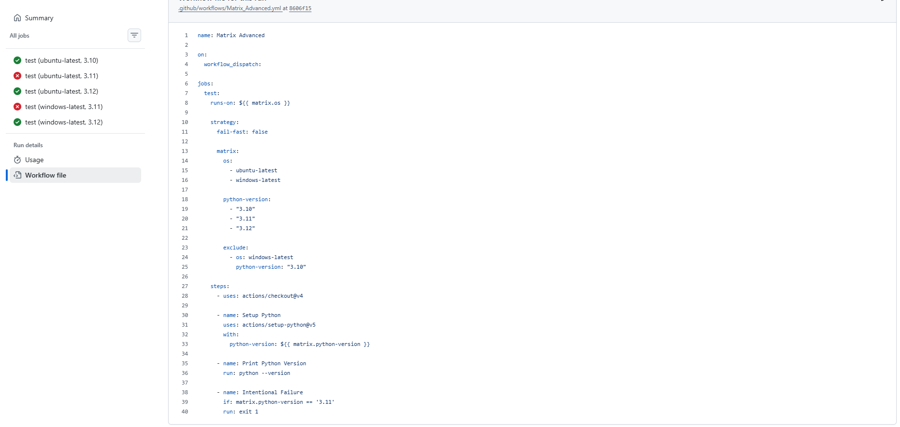
   
   - Observation (`fail-fast: false`):
   - In the workflow, a failure was triggered for Python 3.11 using exit 1. 
   - As shown in the screenshot,the jobs (`windows-latest, 3.11`) and (`ubuntu-latest, 3.11`) `failed`,but the other jobs continued running and completed successfully.
   - This shows that `fail-fast: false` allows all matrix jobs to run even if some fail.

   `fail-fast: true (default)`: If one job fails, the remaining matrix jobs are cancelled.

   `fail-fast: false`: If one job fails, the other jobs continue running until completion.

---
