# Day 43 – Jobs, Steps, Env Vars & Conditionals

---

## Challenge Tasks

### Task 1: Multi-Job Workflow
Create `.github/workflows/multi-job.yml` with 3 jobs:
- `build` — prints "Building the app"
- `test` — prints "Running tests"
- `deploy` — prints "Deploying"

Make `test` run only **after** `build` succeeds.
Make `deploy` run only **after** `test` succeeds.

**Verify:** Check the workflow graph in the Actions tab — does it show the dependency chain?

- Yes It show the dependency chain

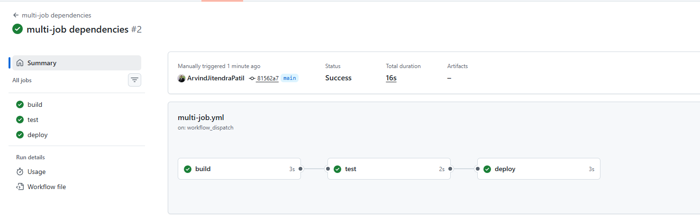

   `needs:` tells gitHub actions which job must finish before this job can start.

- [mult-job.yml](workflows/multi-job.yml)

---

### Task 2: Environment Variables
In a new workflow, use environment variables at 3 levels:
1. **Workflow level** — `APP_NAME: myapp`
2. **Job level** — `ENVIRONMENT: staging`
3. **Step level** — `VERSION: 1.0.0`

Print all three in a single step and verify each is accessible.

Then use a **GitHub context variable** — print the commit SHA and the actor (who triggered the run).

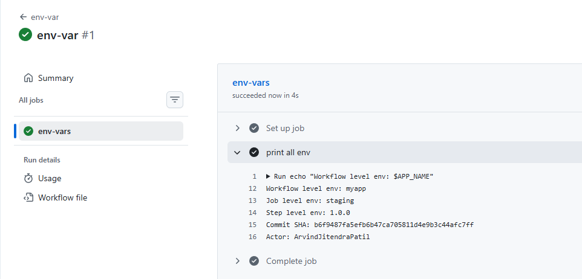

- [env-vars.yml](workflows/env-vars.yml)

---

### Task 3: Job Outputs
1. Create a job that **sets an output** — e.g., today's date as a string
2. Create a second job that **reads that output** and prints it
3. Pass the value using `outputs:` and `needs.<job>.outputs.<name>`

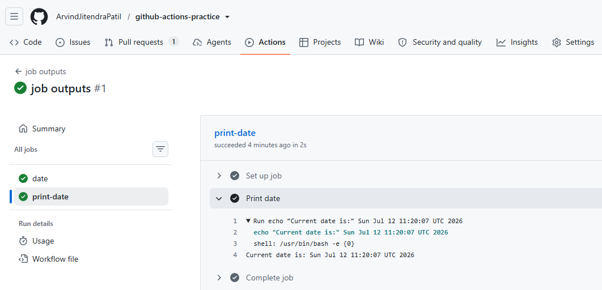
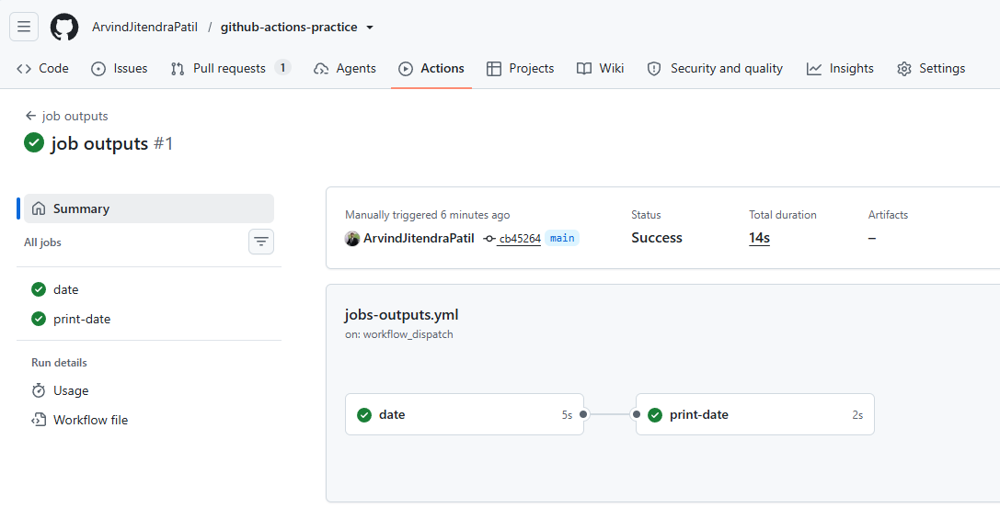

- [jobs-outputs.yml](workflows/jobs-outputs.yml)

Why would you pass outputs between jobs?
- Each job runs separately, so Job 2 cannot see what Job 1 created.
- Outputs are used to pass that result from Job 1 to Job 2.

- Example:

- Job 1 – Build Docker image
    - This job builds the image and creates a tag for example:myapp:1.0.0

- Job 2 – Push image to registry
    - This job must know which image tag was created so it can push the correct image.

- Job 3 – Deploy the app
    - The deployment job also needs the same tag myapp:1.0.0 to deploy that exact image.

- Why pass outputs?
    - The tag created in Job 1 is passed as an output so the other jobs know exactly which Docker image to use.

---

### Task 4: Conditionals
In a workflow, add:
1. A step that only runs when the branch is `main`
2. A step that only runs when the previous step **failed**
3. A job that only runs on **push** events, not on pull requests
4. A step with `continue-on-error: true` — what does this do?

 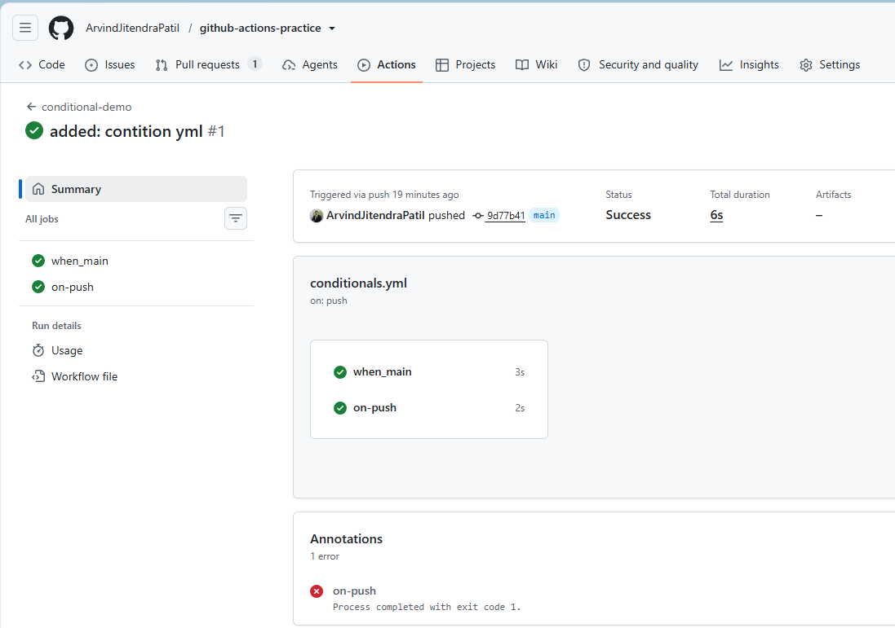
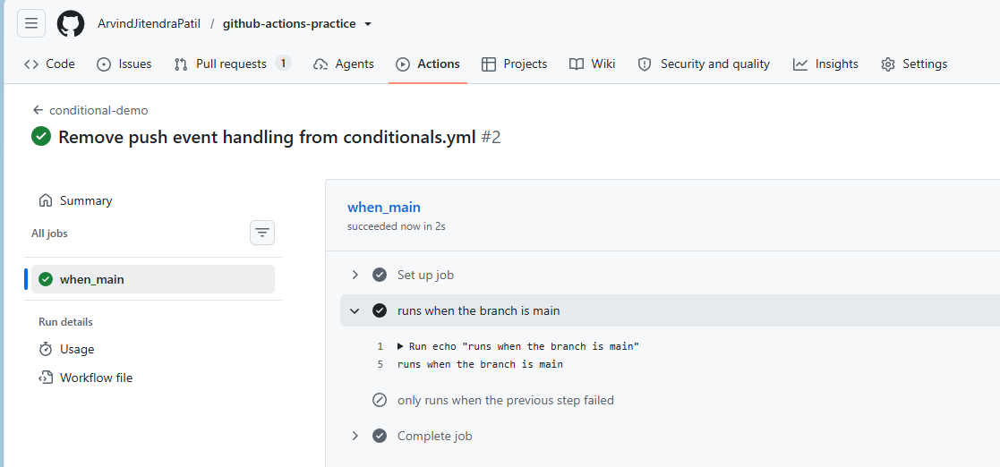
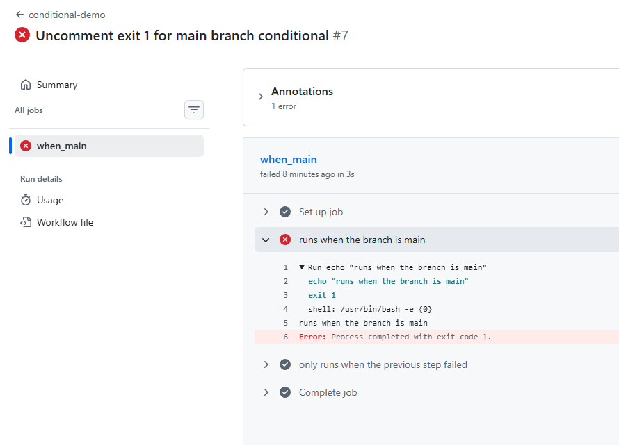
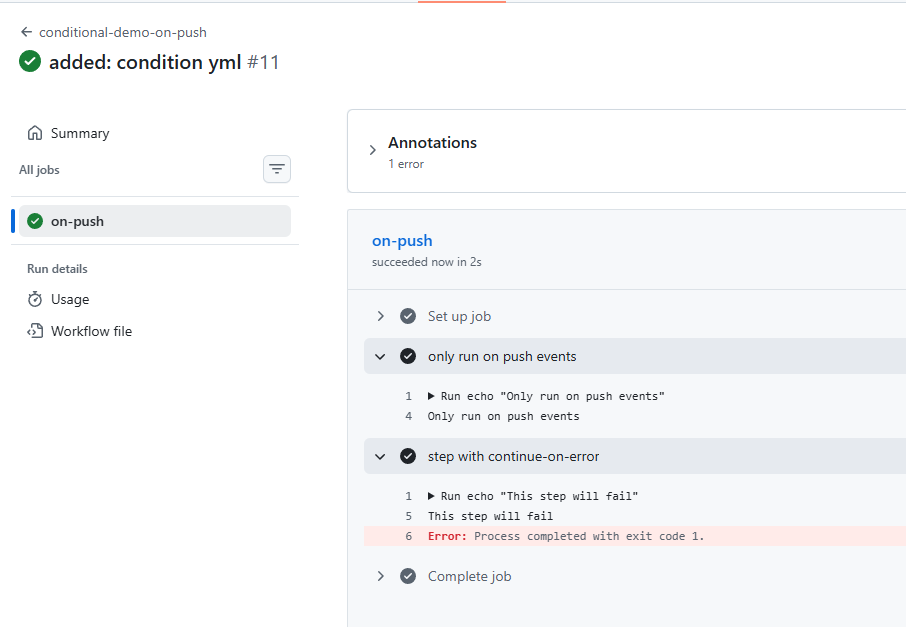

    - `continue-on-error: true` tells the workflow not to fail even if a step or job fails. The workflow continues executing the remaining steps or jobs.

- [conditionals.yml](workflows/conditionals.yml) 
    

---

### Task 5: Putting It Together
Create `.github/workflows/smart-pipeline.yml` that:
1. Triggers on push to any branch
2. Has a `lint` job and a `test` job running in parallel
3. Has a `summary` job that runs after both, prints whether it's a `main` branch push or a feature branch push, and prints the commit message

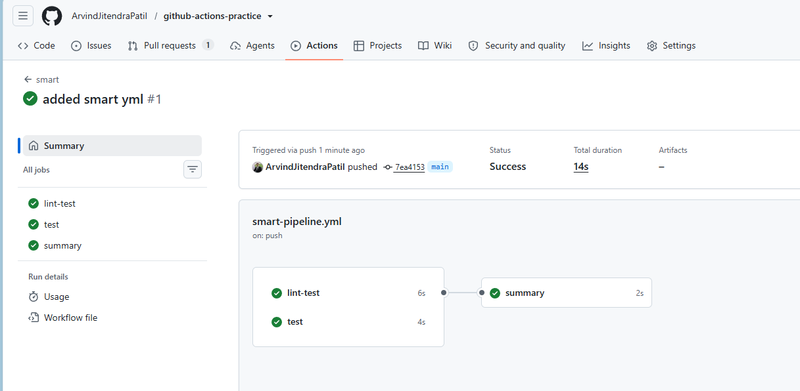
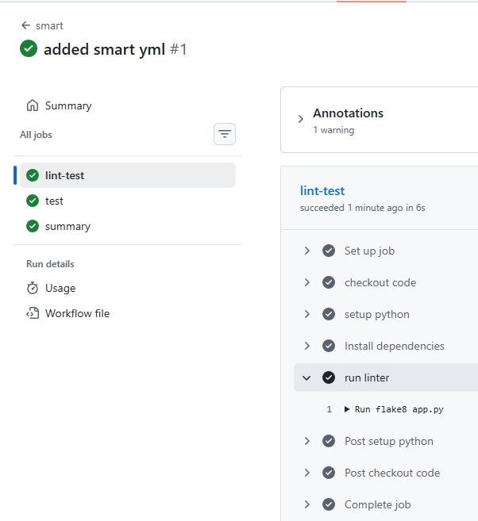
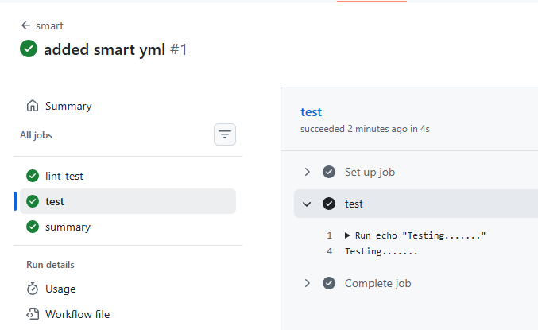
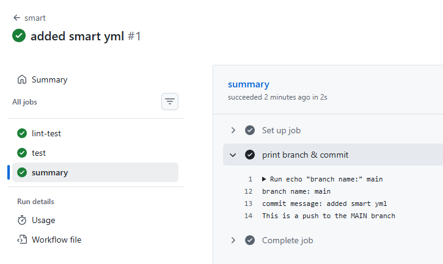

- [smart-pipeline.yml](workflows/smart-pipeline.yml)

---
