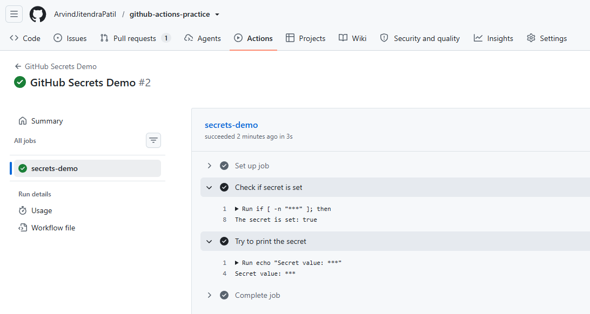
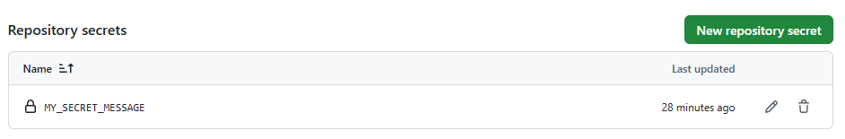

# Day 44 – Secrets, Artifacts & Running Real Tests in CI

## Challenge Tasks

### Task 1: GitHub Secrets
1. Go to your repo → Settings → Secrets and Variables → Actions
2. Create a secret called `MY_SECRET_MESSAGE`
3. Create a workflow that reads it and prints: `The secret is set: true` (never print the actual value)
4. Try to print `${{ secrets.MY_SECRET_MESSAGE }}` directly — what does GitHub show?

- GitHub automatically replaces secrets with ***

   

   

Why should you never print secrets in CI logs?

- CI logs are public or accessible to many team members.

- Printing secrets can expose API keys, tokens, or passwords.

   [Secrets](workflows/secrets.yml)

---
